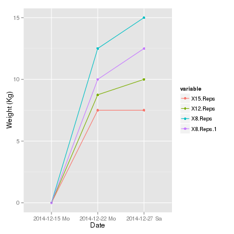
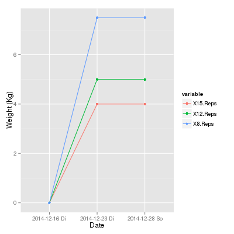
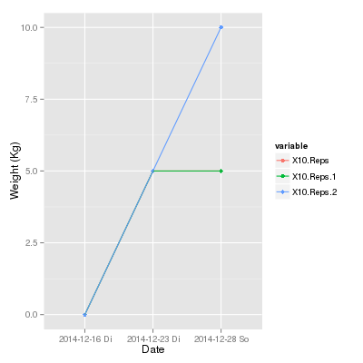

<h2>Table of Contents</h2>

<ul>
<li><a href="#sec-1">1. Capture Templates</a></li>
<li><a href="#sec-2">2. Programming</a>
<ul>
<li><a href="#sec-2-1">2.1. R</a>
<ul>
<li><a href="#sec-2-1-1">2.1.1. Simple R Graph</a></li>
<li><a href="#sec-2-1-2">2.1.2. R Graph with <code>MM:SS</code> at y-axis</a></li>
</ul>
</li>
</ul>
</li>
<li><a href="#sec-3">3. 2014</a>
<ul>
<li><a href="#sec-3-1">3.1. 2014-07 July</a>
<ul>
<li><a href="#sec-3-1-1">3.1.1. 2014-07-20</a></li>
</ul>
</li>
<li><a href="#sec-3-2">3.2. 2014-08 August</a>
<ul>
<li><a href="#sec-3-2-1">3.2.1. 2014-08-06</a></li>
</ul>
</li>
<li><a href="#sec-3-3">3.3. 2014-12 Dezember</a>
<ul>
<li><a href="#sec-3-3-1">3.3.1. 2014-12-12</a></li>
<li><a href="#sec-3-3-2">3.3.2. 2014-12-13</a></li>
<li><a href="#sec-3-3-3">3.3.3. 2014-12-14</a></li>
<li><a href="#sec-3-3-4">3.3.4. 2014-12-15</a></li>
<li><a href="#sec-3-3-5">3.3.5. 2014-12-16</a></li>
<li><a href="#sec-3-3-6">3.3.6. 2014-12-18 Donnerstag</a></li>
<li><a href="#sec-3-3-7">3.3.7. 2014-12-19 Freitag</a></li>
<li><a href="#sec-3-3-8">3.3.8. 2014-12-21 Sonntag</a></li>
<li><a href="#sec-3-3-9">3.3.9. 2014-12-22 Montag</a></li>
<li><a href="#sec-3-3-10">3.3.10. 2014-12-23 Dienstag</a></li>
<li><a href="#sec-3-3-11">3.3.11. 2014-12-24 Mittwoch</a></li>
<li><a href="#sec-3-3-12">3.3.12. 2014-12-25 Donnerstag</a></li>
<li><a href="#sec-3-3-13">3.3.13. 2014-12-26 Freitag</a></li>
<li><a href="#sec-3-3-14">3.3.14. 2014-12-27 Samstag</a></li>
</ul>
</li>
</ul>
</li>
<li><a href="#sec-4">4. Statistics</a>
<ul>
<li><a href="#sec-4-1">4.1. Bulk Chest</a>
<ul>
<li><a href="#sec-4-1-1">4.1.1. Incline Fly</a></li>
<li><a href="#sec-4-1-2">4.1.2. Incline Press</a></li>
<li><a href="#sec-4-1-3">4.1.3. Chest Press with Rotation</a></li>
<li><a href="#sec-4-1-4">4.1.4. Progressive Incline Press</a></li>
<li><a href="#sec-4-1-5">4.1.5. Close Grip Press to Fly</a></li>
</ul>
</li>
<li><a href="#sec-4-2">4.2. Bulk Legs</a>
<ul>
<li><a href="#sec-4-2-1">4.2.1. Front to back Lunge</a></li>
<li><a href="#sec-4-2-2">4.2.2. Squat</a></li>
<li><a href="#sec-4-2-3">4.2.3. Full to 1/2 Sumo Squat</a></li>
<li><a href="#sec-4-2-4">4.2.4. Split Squat w/EZ Bar</a></li>
<li><a href="#sec-4-2-5">4.2.5. Stiff Leg Deadlift</a></li>
<li><a href="#sec-4-2-6">4.2.6. Alt. Side Squat</a></li>
<li><a href="#sec-4-2-7">4.2.7. Calf Raise</a></li>
</ul>
</li>
<li><a href="#sec-4-3">4.3. Bulk Back</a>
<ul>
<li><a href="#sec-4-3-1">4.3.1. Pull-Over</a></li>
<li><a href="#sec-4-3-2">4.3.2. Reverse Grip Row</a></li>
<li><a href="#sec-4-3-3">4.3.3. One Arm Row</a></li>
<li><a href="#sec-4-3-4">4.3.4. Deadlift</a></li>
<li><a href="#sec-4-3-5">4.3.5. Reverse Fly</a></li>
<li><a href="#sec-4-3-6">4.3.6. Plank Rotation</a></li>
</ul>
</li>
<li><a href="#sec-4-4">4.4. Bulk Arms</a>
<ul>
<li><a href="#sec-4-4-1">4.4.1. Standing Curl</a></li>
<li><a href="#sec-4-4-2">4.4.2. Tricep Extension</a></li>
<li><a href="#sec-4-4-3">4.4.3. Wide EZ Bar Curl</a></li>
<li><a href="#sec-4-4-4">4.4.4. Skull Crusher</a></li>
<li><a href="#sec-4-4-5">4.4.5. Hammer Curl</a></li>
<li><a href="#sec-4-4-6">4.4.6. Tricep Kickback</a></li>
<li><a href="#sec-4-4-7">4.4.7. Weighted Crunch</a></li>
</ul>
</li>
<li><a href="#sec-4-5">4.5. Bulk Shoulders</a>
<ul>
<li><a href="#sec-4-5-1">4.5.1. Lateral Raise</a></li>
<li><a href="#sec-4-5-2">4.5.2. Arnold Press</a></li>
<li><a href="#sec-4-5-3">4.5.3. Upright Row</a></li>
<li><a href="#sec-4-5-4">4.5.4. Alt. Front Raise</a></li>
<li><a href="#sec-4-5-5">4.5.5. Plate Twist-Twist</a></li>
<li><a href="#sec-4-5-6">4.5.6. Reverse Fly</a></li>
<li><a href="#sec-4-5-7">4.5.7. Plank Twist-Twist</a></li>
</ul>
</li>
</ul>
</li>
<li><a href="#sec-5">5. Running</a></li>
</ul>

# Capture Templates

    (setq org-capture-templates
          '(("w" "workout" entry (file+datetree "training.org") "* %?\ņ")
            ("e" "beast abs" entry (file+datetree "training.org") "* Beast Abs :bodybeast:beast:abs: \n %?")
            ("c" "bulk chest" entry (file+datetree "training.org") "%[capturetemplates/bulkchest.org]")
            ("l" "bulk legs" entry (file+datetree "training.org") "%[capturetemplates/bulklegs.org]")
            ("a" "bulk arms" entry (file+datetree "training.org") "%[capturetemplates/bulkarms.org]")
            ("b" "bulk back" entry (file+datetree "training.org") "%[capturetemplates/bulkback.org]")
            ("s" "bulk shoulders" entry (file+datetree "training.org") "%[capturetemplates/bulkshoulders.org]")
            ("r" "running" entry (file+datetree "training.org") "* Running :running: \n SCHEDULED: %t\n %^{Time}p")))

# Programming

## R

### Simple R Graph

This graph captures a set

    library(reshape2)
    library(ggplot2)
    p <- ggplot(melt(table, id="Date"), aes(x=Date,y=value, group = variable, colour = variable))  +  geom_point() + ylab("Weight (Kg)") + geom_line()
    p

### R Graph with `MM:SS` at y-axis

I also go running once in a while. Graph the results:

# 2014

## 2014-07 July

### 2014-07-20

1.  DONE Running     :running:

## 2014-08 August

### 2014-08-06

1.  DONE Running     :running:

## 2014-12 Dezember

### 2014-12-12

1.  DONE Bulk Chest     :bodybeast:bulk:chest:

    <table border="2" cellspacing="0" cellpadding="6" rules="groups" frame="hsides">
    
    
    <colgroup>
    <col  class="left" />
    
    <col  class="left" />
    
    <col  class="left" />
    
    <col  class="left" />
    
    <col  class="left" />
    </colgroup>
    <thead>
    <tr>
    <th scope="col" class="left">Super Set</th>
    <th scope="col" class="left">15 Reps</th>
    <th scope="col" class="left">12 Reps</th>
    <th scope="col" class="left">8 Reps</th>
    <th scope="col" class="left">8 Reps</th>
    </tr>
    </thead>
    
    <tbody>
    <tr>
    <td class="left">Incline Fly</td>
    <td class="left">&#xa0;</td>
    <td class="left">&#xa0;</td>
    <td class="left">&#xa0;</td>
    <td class="left">&#xa0;</td>
    </tr>
    
    
    <tr>
    <td class="left">Incline Press</td>
    <td class="left">&#xa0;</td>
    <td class="left">&#xa0;</td>
    <td class="left">&#xa0;</td>
    <td class="left">&#xa0;</td>
    </tr>
    </tbody>
    </table>
    
    Here&rsquo;s room for comments. 
    
    <table border="2" cellspacing="0" cellpadding="6" rules="groups" frame="hsides">
    
    
    <colgroup>
    <col  class="left" />
    
    <col  class="left" />
    
    <col  class="left" />
    
    <col  class="left" />
    
    <col  class="left" />
    
    <col  class="left" />
    </colgroup>
    <thead>
    <tr>
    <th scope="col" class="left">Force Set</th>
    <th scope="col" class="left">5 Reps</th>
    <th scope="col" class="left">5 Reps</th>
    <th scope="col" class="left">5 Reps</th>
    <th scope="col" class="left">5 Reps</th>
    <th scope="col" class="left">5 Reps</th>
    </tr>
    </thead>
    
    <tbody>
    <tr>
    <td class="left">Chest Press with Rotation</td>
    <td class="left">&#xa0;</td>
    <td class="left">&#xa0;</td>
    <td class="left">&#xa0;</td>
    <td class="left">&#xa0;</td>
    <td class="left">&#xa0;</td>
    </tr>
    </tbody>
    </table>
    
    <table border="2" cellspacing="0" cellpadding="6" rules="groups" frame="hsides">
    
    
    <colgroup>
    <col  class="left" />
    
    <col  class="left" />
    
    <col  class="left" />
    
    <col  class="left" />
    
    <col  class="left" />
    
    <col  class="left" />
    
    <col  class="left" />
    </colgroup>
    <thead>
    <tr>
    <th scope="col" class="left">Progressive Set</th>
    <th scope="col" class="left">15 Reps</th>
    <th scope="col" class="left">12 Reps</th>
    <th scope="col" class="left">8 Reps</th>
    <th scope="col" class="left">8 Reps</th>
    <th scope="col" class="left">12 Reps</th>
    <th scope="col" class="left">15 Reps</th>
    </tr>
    </thead>
    
    <tbody>
    <tr>
    <td class="left">Incline Press 2</td>
    <td class="left">&#xa0;</td>
    <td class="left">&#xa0;</td>
    <td class="left">&#xa0;</td>
    <td class="left">&#xa0;</td>
    <td class="left">&#xa0;</td>
    <td class="left">&#xa0;</td>
    </tr>
    </tbody>
    </table>
    
    <table border="2" cellspacing="0" cellpadding="6" rules="groups" frame="hsides">
    
    
    <colgroup>
    <col  class="left" />
    
    <col  class="left" />
    
    <col  class="left" />
    
    <col  class="left" />
    </colgroup>
    <thead>
    <tr>
    <th scope="col" class="left">Combo Set</th>
    <th scope="col" class="left">15 Reps</th>
    <th scope="col" class="left">12 Reps</th>
    <th scope="col" class="left">8 Reps</th>
    </tr>
    </thead>
    
    <tbody>
    <tr>
    <td class="left">Close Grip Press to Fly</td>
    <td class="left">&#xa0;</td>
    <td class="left">&#xa0;</td>
    <td class="left">&#xa0;</td>
    </tr>
    </tbody>
    </table>

### 2014-12-13

1.  DONE Bulk Legs     :bodybeast:bulk:legs:

    <table border="2" cellspacing="0" cellpadding="6" rules="groups" frame="hsides">
    
    
    <colgroup>
    <col  class="left" />
    
    <col  class="left" />
    
    <col  class="left" />
    
    <col  class="left" />
    </colgroup>
    <thead>
    <tr>
    <th scope="col" class="left">&#xa0;</th>
    <th scope="col" class="left">15 Reps</th>
    <th scope="col" class="left">12 Reps</th>
    <th scope="col" class="left">8 Reps</th>
    </tr>
    </thead>
    
    <tbody>
    <tr>
    <td class="left">Front to Back Lunge</td>
    <td class="left">5Kg</td>
    <td class="left">7.5Kg</td>
    <td class="left">10Kg</td>
    </tr>
    </tbody>
    </table>
    
    <table border="2" cellspacing="0" cellpadding="6" rules="groups" frame="hsides">
    
    
    <colgroup>
    <col  class="left" />
    
    <col  class="left" />
    
    <col  class="left" />
    
    <col  class="left" />
    
    <col  class="left" />
    
    <col  class="left" />
    
    <col  class="left" />
    </colgroup>
    <thead>
    <tr>
    <th scope="col" class="left">&#xa0;</th>
    <th scope="col" class="left">15 Reps</th>
    <th scope="col" class="left">12 Reps</th>
    <th scope="col" class="left">8 Reps</th>
    <th scope="col" class="left">8 Reps</th>
    <th scope="col" class="left">12 Reps</th>
    <th scope="col" class="left">15 Reps</th>
    </tr>
    </thead>
    
    <tbody>
    <tr>
    <td class="left">Squat</td>
    <td class="left">5 Kg</td>
    <td class="left">7.5Kg</td>
    <td class="left">&#xa0;</td>
    <td class="left">&#xa0;</td>
    <td class="left">&#xa0;</td>
    <td class="left">&#xa0;</td>
    </tr>
    </tbody>
    </table>
    
    <table border="2" cellspacing="0" cellpadding="6" rules="groups" frame="hsides">
    
    
    <colgroup>
    <col  class="left" />
    
    <col  class="left" />
    
    <col  class="left" />
    
    <col  class="left" />
    
    <col  class="left" />
    
    <col  class="left" />
    </colgroup>
    <thead>
    <tr>
    <th scope="col" class="left">&#xa0;</th>
    <th scope="col" class="left">5 Reps</th>
    <th scope="col" class="left">5 Reps</th>
    <th scope="col" class="left">5 Reps</th>
    <th scope="col" class="left">5 Reps</th>
    <th scope="col" class="left">5 Reps</th>
    </tr>
    </thead>
    
    <tbody>
    <tr>
    <td class="left">Full to 1/2 Sumo Squat</td>
    <td class="left">&#xa0;</td>
    <td class="left">&#xa0;</td>
    <td class="left">&#xa0;</td>
    <td class="left">&#xa0;</td>
    <td class="left">&#xa0;</td>
    </tr>
    </tbody>
    </table>
    
    <table border="2" cellspacing="0" cellpadding="6" rules="groups" frame="hsides">
    
    
    <colgroup>
    <col  class="left" />
    
    <col  class="left" />
    
    <col  class="left" />
    
    <col  class="left" />
    
    <col  class="left" />
    
    <col  class="left" />
    
    <col  class="left" />
    </colgroup>
    <thead>
    <tr>
    <th scope="col" class="left">&#xa0;</th>
    <th scope="col" class="left">15 Reps</th>
    <th scope="col" class="left">12 Reps</th>
    <th scope="col" class="left">8 Reps</th>
    <th scope="col" class="left">8 Reps</th>
    <th scope="col" class="left">12 Reps</th>
    <th scope="col" class="left">15 Reps</th>
    </tr>
    </thead>
    
    <tbody>
    <tr>
    <td class="left">Split Squat w/EZ Bar</td>
    <td class="left">2.5Kg</td>
    <td class="left">3.75Kg</td>
    <td class="left">3.75Kg</td>
    <td class="left">5Kg</td>
    <td class="left">3.75Kg</td>
    <td class="left">2.5Kg</td>
    </tr>
    </tbody>
    </table>
    
    <table border="2" cellspacing="0" cellpadding="6" rules="groups" frame="hsides">
    
    
    <colgroup>
    <col  class="left" />
    
    <col  class="left" />
    
    <col  class="left" />
    
    <col  class="left" />
    
    <col  class="left" />
    </colgroup>
    <thead>
    <tr>
    <th scope="col" class="left">&#xa0;</th>
    <th scope="col" class="left">15 Reps</th>
    <th scope="col" class="left">12 Reps</th>
    <th scope="col" class="left">8 Reps</th>
    <th scope="col" class="left">8 Reps</th>
    </tr>
    </thead>
    
    <tbody>
    <tr>
    <td class="left">Stiff Leg Deadlift</td>
    <td class="left">5Kg</td>
    <td class="left">7.5Kg</td>
    <td class="left">&#xa0;</td>
    <td class="left">&#xa0;</td>
    </tr>
    
    
    <tr>
    <td class="left">Alt. Side Squat</td>
    <td class="left">5Kg</td>
    <td class="left">5Kg</td>
    <td class="left">5Kg</td>
    <td class="left">5Kg</td>
    </tr>
    </tbody>
    </table>
    
    <table border="2" cellspacing="0" cellpadding="6" rules="groups" frame="hsides">
    
    
    <colgroup>
    <col  class="left" />
    
    <col  class="left" />
    
    <col  class="left" />
    </colgroup>
    <thead>
    <tr>
    <th scope="col" class="left">&#xa0;</th>
    <th scope="col" class="left">50 Reps</th>
    <th scope="col" class="left">50 Reps</th>
    </tr>
    </thead>
    
    <tbody>
    <tr>
    <td class="left">Calf Raise</td>
    <td class="left">7.5-4Kg</td>
    <td class="left">7.5-4Kg</td>
    </tr>
    
    
    <tr>
    <td class="left">Beast Abs</td>
    <td class="left">&#xa0;</td>
    <td class="left">&#xa0;</td>
    </tr>
    </tbody>
    </table>

### 2014-12-14

1.  DONE Bulk Back     :bodybeast:bulk:back:

    <table border="2" cellspacing="0" cellpadding="6" rules="groups" frame="hsides">
    
    
    <colgroup>
    <col  class="left" />
    
    <col  class="left" />
    
    <col  class="left" />
    
    <col  class="left" />
    
    <col  class="left" />
    </colgroup>
    <thead>
    <tr>
    <th scope="col" class="left">Super Set</th>
    <th scope="col" class="left">15 Reps</th>
    <th scope="col" class="left">12 Reps</th>
    <th scope="col" class="left">8 Reps</th>
    <th scope="col" class="left">8 Reps</th>
    </tr>
    </thead>
    
    <tbody>
    <tr>
    <td class="left">Pull-Over</td>
    <td class="left">&#xa0;</td>
    <td class="left">&#xa0;</td>
    <td class="left">&#xa0;</td>
    <td class="left">&#xa0;</td>
    </tr>
    
    
    <tr>
    <td class="left">Pull-Up</td>
    <td class="left">10 Reps</td>
    <td class="left">10 Reps</td>
    <td class="left">10 Reps</td>
    <td class="left">&#xa0;</td>
    </tr>
    </tbody>
    </table>
    
    <table border="2" cellspacing="0" cellpadding="6" rules="groups" frame="hsides">
    
    
    <colgroup>
    <col  class="left" />
    
    <col  class="left" />
    
    <col  class="left" />
    
    <col  class="left" />
    
    <col  class="left" />
    
    <col  class="left" />
    
    <col  class="left" />
    </colgroup>
    <thead>
    <tr>
    <th scope="col" class="left">Progressive Set</th>
    <th scope="col" class="left">15 Reps</th>
    <th scope="col" class="left">12 Reps</th>
    <th scope="col" class="left">8 Reps</th>
    <th scope="col" class="left">8 Reps</th>
    <th scope="col" class="left">12 Reps</th>
    <th scope="col" class="left">15 Reps</th>
    </tr>
    </thead>
    
    <tbody>
    <tr>
    <td class="left">Reverse Grip Row</td>
    <td class="left">&#xa0;</td>
    <td class="left">&#xa0;</td>
    <td class="left">&#xa0;</td>
    <td class="left">&#xa0;</td>
    <td class="left">&#xa0;</td>
    <td class="left">&#xa0;</td>
    </tr>
    </tbody>
    </table>
    
    <table border="2" cellspacing="0" cellpadding="6" rules="groups" frame="hsides">
    
    
    <colgroup>
    <col  class="left" />
    
    <col  class="left" />
    
    <col  class="left" />
    
    <col  class="left" />
    
    <col  class="left" />
    
    <col  class="left" />
    </colgroup>
    <thead>
    <tr>
    <th scope="col" class="left">Force Set</th>
    <th scope="col" class="left">5 Reps</th>
    <th scope="col" class="left">5 Reps</th>
    <th scope="col" class="left">5 Reps</th>
    <th scope="col" class="left">5 Reps</th>
    <th scope="col" class="left">5 Reps</th>
    </tr>
    </thead>
    
    <tbody>
    <tr>
    <td class="left">One-Arm Row</td>
    <td class="left">&#xa0;</td>
    <td class="left">&#xa0;</td>
    <td class="left">&#xa0;</td>
    <td class="left">&#xa0;</td>
    <td class="left">&#xa0;</td>
    </tr>
    </tbody>
    </table>
    
    <table border="2" cellspacing="0" cellpadding="6" rules="groups" frame="hsides">
    
    
    <colgroup>
    <col  class="left" />
    
    <col  class="left" />
    
    <col  class="left" />
    
    <col  class="left" />
    
    <col  class="left" />
    </colgroup>
    <thead>
    <tr>
    <th scope="col" class="left">Single Set</th>
    <th scope="col" class="left">15 Reps</th>
    <th scope="col" class="left">12 Reps</th>
    <th scope="col" class="left">8 Reps</th>
    <th scope="col" class="left">8 Reps</th>
    </tr>
    </thead>
    
    <tbody>
    <tr>
    <td class="left">Deadlift</td>
    <td class="left">&#xa0;</td>
    <td class="left">&#xa0;</td>
    <td class="left">&#xa0;</td>
    <td class="left">&#xa0;</td>
    </tr>
    </tbody>
    </table>
    
    <table border="2" cellspacing="0" cellpadding="6" rules="groups" frame="hsides">
    
    
    <colgroup>
    <col  class="left" />
    
    <col  class="left" />
    
    <col  class="left" />
    </colgroup>
    <thead>
    <tr>
    <th scope="col" class="left">Super Set</th>
    <th scope="col" class="left">15 Reps</th>
    <th scope="col" class="left">12 Reps</th>
    </tr>
    </thead>
    
    <tbody>
    <tr>
    <td class="left">Reverse Fly</td>
    <td class="left">&#xa0;</td>
    <td class="left">&#xa0;</td>
    </tr>
    </tbody>
    
    <tbody>
    <tr>
    <td class="left">&#xa0;</td>
    <td class="left">30 Sec.</td>
    <td class="left">30 Sec.</td>
    </tr>
    </tbody>
    
    <tbody>
    <tr>
    <td class="left">Plank Rotation</td>
    <td class="left">&#xa0;</td>
    <td class="left">&#xa0;</td>
    </tr>
    </tbody>
    </table>

### 2014-12-15

1.  DONE Bulk Arms     :bodybeast:bulk:arms:

    <table border="2" cellspacing="0" cellpadding="6" rules="groups" frame="hsides">
    
    
    <colgroup>
    <col  class="left" />
    
    <col  class="left" />
    
    <col  class="left" />
    
    <col  class="left" />
    
    <col  class="left" />
    
    <col  class="left" />
    
    <col  class="left" />
    </colgroup>
    <thead>
    <tr>
    <th scope="col" class="left">&#xa0;</th>
    <th scope="col" class="left">15 Reps</th>
    <th scope="col" class="left">12 Reps</th>
    <th scope="col" class="left">8 Reps</th>
    <th scope="col" class="left">8 Reps</th>
    <th scope="col" class="left">12 Reps</th>
    <th scope="col" class="left">15 Reps</th>
    </tr>
    </thead>
    
    <tbody>
    <tr>
    <td class="left">Standing Curl</td>
    <td class="left">&#xa0;</td>
    <td class="left">&#xa0;</td>
    <td class="left">&#xa0;</td>
    <td class="left">&#xa0;</td>
    <td class="left">&#xa0;</td>
    <td class="left">&#xa0;</td>
    </tr>
    </tbody>
    </table>
    
    <table border="2" cellspacing="0" cellpadding="6" rules="groups" frame="hsides">
    
    
    <colgroup>
    <col  class="left" />
    
    <col  class="left" />
    
    <col  class="left" />
    
    <col  class="left" />
    
    <col  class="left" />
    </colgroup>
    <thead>
    <tr>
    <th scope="col" class="left">&#xa0;</th>
    <th scope="col" class="left">15 Reps</th>
    <th scope="col" class="left">12 Reps</th>
    <th scope="col" class="left">8 Reps</th>
    <th scope="col" class="left">8 Reps</th>
    </tr>
    </thead>
    
    <tbody>
    <tr>
    <td class="left">Tricep Extension</td>
    <td class="left">&#xa0;</td>
    <td class="left">&#xa0;</td>
    <td class="left">&#xa0;</td>
    <td class="left">&#xa0;</td>
    </tr>
    </tbody>
    </table>
    
    <table border="2" cellspacing="0" cellpadding="6" rules="groups" frame="hsides">
    
    
    <colgroup>
    <col  class="left" />
    
    <col  class="left" />
    
    <col  class="left" />
    
    <col  class="left" />
    
    <col  class="left" />
    
    <col  class="left" />
    </colgroup>
    <thead>
    <tr>
    <th scope="col" class="left">&#xa0;</th>
    <th scope="col" class="left">5 Reps</th>
    <th scope="col" class="left">5 Reps</th>
    <th scope="col" class="left">5 Reps</th>
    <th scope="col" class="left">5 Reps</th>
    <th scope="col" class="left">5 Reps</th>
    </tr>
    </thead>
    
    <tbody>
    <tr>
    <td class="left">Wide EZ Bar Curl</td>
    <td class="left">5Kg</td>
    <td class="left">5Kg</td>
    <td class="left">5 Kg</td>
    <td class="left">5 Kg</td>
    <td class="left">5 Kg</td>
    </tr>
    </tbody>
    </table>
    
    <table border="2" cellspacing="0" cellpadding="6" rules="groups" frame="hsides">
    
    
    <colgroup>
    <col  class="left" />
    
    <col  class="left" />
    
    <col  class="left" />
    
    <col  class="left" />
    
    <col  class="left" />
    </colgroup>
    <thead>
    <tr>
    <th scope="col" class="left">&#xa0;</th>
    <th scope="col" class="left">15 Reps</th>
    <th scope="col" class="left">12 Reps</th>
    <th scope="col" class="left">8 Reps</th>
    <th scope="col" class="left">8 Reps</th>
    </tr>
    </thead>
    
    <tbody>
    <tr>
    <td class="left">Skull Crusher</td>
    <td class="left">&#xa0;</td>
    <td class="left">&#xa0;</td>
    <td class="left">&#xa0;</td>
    <td class="left">&#xa0;</td>
    </tr>
    </tbody>
    </table>
    
    <table border="2" cellspacing="0" cellpadding="6" rules="groups" frame="hsides">
    
    
    <colgroup>
    <col  class="left" />
    
    <col  class="left" />
    
    <col  class="left" />
    
    <col  class="left" />
    
    <col  class="left" />
    
    <col  class="left" />
    
    <col  class="left" />
    </colgroup>
    <thead>
    <tr>
    <th scope="col" class="left">&#xa0;</th>
    <th scope="col" class="left">15 Reps</th>
    <th scope="col" class="left">12 Reps</th>
    <th scope="col" class="left">8 Reps</th>
    <th scope="col" class="left">8 Reps</th>
    <th scope="col" class="left">12 Reps</th>
    <th scope="col" class="left">15 Reps</th>
    </tr>
    </thead>
    
    <tbody>
    <tr>
    <td class="left">Hammer Curl</td>
    <td class="left">&#xa0;</td>
    <td class="left">&#xa0;</td>
    <td class="left">&#xa0;</td>
    <td class="left">&#xa0;</td>
    <td class="left">&#xa0;</td>
    <td class="left">&#xa0;</td>
    </tr>
    </tbody>
    </table>
    
    <table border="2" cellspacing="0" cellpadding="6" rules="groups" frame="hsides">
    
    
    <colgroup>
    <col  class="left" />
    
    <col  class="left" />
    
    <col  class="left" />
    
    <col  class="left" />
    
    <col  class="left" />
    
    <col  class="left" />
    
    <col  class="left" />
    </colgroup>
    <thead>
    <tr>
    <th scope="col" class="left">&#xa0;</th>
    <th scope="col" class="left">15 Reps</th>
    <th scope="col" class="left">12 Reps</th>
    <th scope="col" class="left">8 Reps</th>
    <th scope="col" class="left">8 Reps</th>
    <th scope="col" class="left">12 Reps</th>
    <th scope="col" class="left">15 Reps</th>
    </tr>
    </thead>
    
    <tbody>
    <tr>
    <td class="left">Tricep Kickback</td>
    <td class="left">5 Kg</td>
    <td class="left">7.5 KG</td>
    <td class="left">8.75 Kg</td>
    <td class="left">8.75Kg</td>
    <td class="left">5 Kg</td>
    <td class="left">4 Kg</td>
    </tr>
    </tbody>
    </table>
    
    <table border="2" cellspacing="0" cellpadding="6" rules="groups" frame="hsides">
    
    
    <colgroup>
    <col  class="left" />
    
    <col  class="left" />
    </colgroup>
    <thead>
    <tr>
    <th scope="col" class="left">&#xa0;</th>
    <th scope="col" class="left">30 Reps</th>
    </tr>
    </thead>
    
    <tbody>
    <tr>
    <td class="left">Weighted Crunch</td>
    <td class="left">5 Kg</td>
    </tr>
    </tbody>
    </table>

2.  DONE Beast Abs     :bodybeast:beast:abs:

### 2014-12-16

1.  DONE Bulk Shoulders     :bodybeast:bulk:shoulders:

    <table border="2" cellspacing="0" cellpadding="6" rules="groups" frame="hsides">
    
    
    <colgroup>
    <col  class="left" />
    
    <col  class="left" />
    
    <col  class="left" />
    
    <col  class="left" />
    
    <col  class="left" />
    </colgroup>
    <thead>
    <tr>
    <th scope="col" class="left">Super Set</th>
    <th scope="col" class="left">15 Reps</th>
    <th scope="col" class="left">12 Reps</th>
    <th scope="col" class="left">8 Reps</th>
    <th scope="col" class="left">8 Reps</th>
    </tr>
    </thead>
    
    <tbody>
    <tr>
    <td class="left">Lateral Raise</td>
    <td class="left">&#xa0;</td>
    <td class="left">&#xa0;</td>
    <td class="left">&#xa0;</td>
    <td class="left">&#xa0;</td>
    </tr>
    
    
    <tr>
    <td class="left">Arnold Press</td>
    <td class="left">&#xa0;</td>
    <td class="left">&#xa0;</td>
    <td class="left">&#xa0;</td>
    <td class="left">&#xa0;</td>
    </tr>
    </tbody>
    </table>
    
    <table border="2" cellspacing="0" cellpadding="6" rules="groups" frame="hsides">
    
    
    <colgroup>
    <col  class="left" />
    
    <col  class="left" />
    
    <col  class="left" />
    
    <col  class="left" />
    
    <col  class="left" />
    
    <col  class="left" />
    
    <col  class="left" />
    </colgroup>
    <thead>
    <tr>
    <th scope="col" class="left">Progressive Set</th>
    <th scope="col" class="left">15 Reps</th>
    <th scope="col" class="left">12 Reps</th>
    <th scope="col" class="left">8 Reps</th>
    <th scope="col" class="left">8 Reps</th>
    <th scope="col" class="left">12 Reps</th>
    <th scope="col" class="left">15 Reps</th>
    </tr>
    </thead>
    
    <tbody>
    <tr>
    <td class="left">Upright Row</td>
    <td class="left">&#xa0;</td>
    <td class="left">&#xa0;</td>
    <td class="left">&#xa0;</td>
    <td class="left">&#xa0;</td>
    <td class="left">&#xa0;</td>
    <td class="left">&#xa0;</td>
    </tr>
    </tbody>
    </table>
    
    <table border="2" cellspacing="0" cellpadding="6" rules="groups" frame="hsides">
    
    
    <colgroup>
    <col  class="left" />
    
    <col  class="left" />
    
    <col  class="left" />
    
    <col  class="left" />
    </colgroup>
    <thead>
    <tr>
    <th scope="col" class="left">Super Set</th>
    <th scope="col" class="left">15 Reps</th>
    <th scope="col" class="left">12 Reps</th>
    <th scope="col" class="left">8 Reps</th>
    </tr>
    </thead>
    
    <tbody>
    <tr>
    <td class="left">Alt. Front Raise</td>
    <td class="left">&#xa0;</td>
    <td class="left">&#xa0;</td>
    <td class="left">&#xa0;</td>
    </tr>
    
    
    <tr>
    <td class="left">Plate Twist-Twist</td>
    <td class="left">&#xa0;</td>
    <td class="left">&#xa0;</td>
    <td class="left">&#xa0;</td>
    </tr>
    </tbody>
    </table>
    
    <table border="2" cellspacing="0" cellpadding="6" rules="groups" frame="hsides">
    
    
    <colgroup>
    <col  class="left" />
    
    <col  class="left" />
    
    <col  class="left" />
    
    <col  class="left" />
    
    <col  class="left" />
    
    <col  class="left" />
    
    <col  class="left" />
    </colgroup>
    <thead>
    <tr>
    <th scope="col" class="left">Progressive Set</th>
    <th scope="col" class="left">15 Reps</th>
    <th scope="col" class="left">12 Reps</th>
    <th scope="col" class="left">8 Reps</th>
    <th scope="col" class="left">8 Reps</th>
    <th scope="col" class="left">12 Reps</th>
    <th scope="col" class="left">15 Reps</th>
    </tr>
    </thead>
    
    <tbody>
    <tr>
    <td class="left">Reverse Fly</td>
    <td class="left">&#xa0;</td>
    <td class="left">&#xa0;</td>
    <td class="left">&#xa0;</td>
    <td class="left">&#xa0;</td>
    <td class="left">&#xa0;</td>
    <td class="left">&#xa0;</td>
    </tr>
    </tbody>
    </table>
    
    <table border="2" cellspacing="0" cellpadding="6" rules="groups" frame="hsides">
    
    
    <colgroup>
    <col  class="left" />
    
    <col  class="left" />
    
    <col  class="left" />
    </colgroup>
    <thead>
    <tr>
    <th scope="col" class="left">Super Set</th>
    <th scope="col" class="left">10 Reps</th>
    <th scope="col" class="left">10 Reps</th>
    </tr>
    </thead>
    
    <tbody>
    <tr>
    <td class="left">Superman Stretch</td>
    <td class="left">&#xa0;</td>
    <td class="left">&#xa0;</td>
    </tr>
    </tbody>
    
    <tbody>
    <tr>
    <td class="left">&#xa0;</td>
    <td class="left">30 Sec.</td>
    <td class="left">30 Sec.</td>
    </tr>
    </tbody>
    
    <tbody>
    <tr>
    <td class="left">Plank Twist-Twist</td>
    <td class="left">&#xa0;</td>
    <td class="left">&#xa0;</td>
    </tr>
    </tbody>
    </table>

### 2014-12-18 Donnerstag

1.  Bulk Chest     :bodybeast:bulk:chest:

    <table border="2" cellspacing="0" cellpadding="6" rules="groups" frame="hsides">
    
    
    <colgroup>
    <col  class="left" />
    
    <col  class="left" />
    
    <col  class="left" />
    
    <col  class="left" />
    
    <col  class="left" />
    </colgroup>
    <thead>
    <tr>
    <th scope="col" class="left">Super Set</th>
    <th scope="col" class="left">15 Reps</th>
    <th scope="col" class="left">12 Reps</th>
    <th scope="col" class="left">8 Reps</th>
    <th scope="col" class="left">8 Reps</th>
    </tr>
    </thead>
    
    <tbody>
    <tr>
    <td class="left">Incline Fly</td>
    <td class="left">5 Kg</td>
    <td class="left">7.5 Kg</td>
    <td class="left">10 Kg</td>
    <td class="left">&#xa0;</td>
    </tr>
    
    
    <tr>
    <td class="left">Incline Press</td>
    <td class="left">7.5 Kg</td>
    <td class="left">10 Kg</td>
    <td class="left">12.5 Kg</td>
    <td class="left">10 Kg</td>
    </tr>
    </tbody>
    </table>
    
    <table border="2" cellspacing="0" cellpadding="6" rules="groups" frame="hsides">
    
    
    <colgroup>
    <col  class="left" />
    
    <col  class="left" />
    
    <col  class="left" />
    
    <col  class="left" />
    
    <col  class="left" />
    
    <col  class="left" />
    </colgroup>
    <thead>
    <tr>
    <th scope="col" class="left">Force Set</th>
    <th scope="col" class="left">5 Reps</th>
    <th scope="col" class="left">5 Reps</th>
    <th scope="col" class="left">5 Reps</th>
    <th scope="col" class="left">5 Reps</th>
    <th scope="col" class="left">5 Reps</th>
    </tr>
    </thead>
    
    <tbody>
    <tr>
    <td class="left">Chest Press with Rotation</td>
    <td class="left">8.75 Kg</td>
    <td class="left">8.75 Kg</td>
    <td class="left">8.75 Kg</td>
    <td class="left">8.75 Kg</td>
    <td class="left">8.75 Kg</td>
    </tr>
    </tbody>
    </table>
    
    <table border="2" cellspacing="0" cellpadding="6" rules="groups" frame="hsides">
    
    
    <colgroup>
    <col  class="left" />
    
    <col  class="left" />
    
    <col  class="left" />
    
    <col  class="left" />
    
    <col  class="left" />
    
    <col  class="left" />
    
    <col  class="left" />
    </colgroup>
    <thead>
    <tr>
    <th scope="col" class="left">Progressive Set</th>
    <th scope="col" class="left">15 Reps</th>
    <th scope="col" class="left">12 Reps</th>
    <th scope="col" class="left">8 Reps</th>
    <th scope="col" class="left">8 Reps</th>
    <th scope="col" class="left">12 Reps</th>
    <th scope="col" class="left">15 Reps</th>
    </tr>
    </thead>
    
    <tbody>
    <tr>
    <td class="left">Incline Press 2</td>
    <td class="left">7.5 Kg</td>
    <td class="left">8.75 Kg</td>
    <td class="left">10Kg</td>
    <td class="left">10 Kg</td>
    <td class="left">8.75 Kg</td>
    <td class="left">7.5 Kg</td>
    </tr>
    </tbody>
    </table>
    
    <table border="2" cellspacing="0" cellpadding="6" rules="groups" frame="hsides">
    
    
    <colgroup>
    <col  class="left" />
    
    <col  class="left" />
    
    <col  class="left" />
    
    <col  class="left" />
    </colgroup>
    <thead>
    <tr>
    <th scope="col" class="left">Combo Set</th>
    <th scope="col" class="left">15 Reps</th>
    <th scope="col" class="left">12 Reps</th>
    <th scope="col" class="left">8 Reps</th>
    </tr>
    </thead>
    
    <tbody>
    <tr>
    <td class="left">Close Grip Press to Fly</td>
    <td class="left">5 Kg</td>
    <td class="left">7.5 Kg</td>
    <td class="left">10 Kg</td>
    </tr>
    </tbody>
    </table>
    
    <table border="2" cellspacing="0" cellpadding="6" rules="groups" frame="hsides">
    
    
    <colgroup>
    <col  class="left" />
    
    <col  class="left" />
    
    <col  class="left" />
    
    <col  class="left" />
    </colgroup>
    <thead>
    <tr>
    <th scope="col" class="left">Multi Set</th>
    <th scope="col" class="left">15 Reps</th>
    <th scope="col" class="left">12 Reps</th>
    <th scope="col" class="left">8 Reps</th>
    </tr>
    </thead>
    
    <tbody>
    <tr>
    <td class="left">Decline Push-Up</td>
    <td class="left">15 Reps</td>
    <td class="left">12 Reps</td>
    <td class="left">8 Reps</td>
    </tr>
    
    
    <tr>
    <td class="left">Cobra to Airplane</td>
    <td class="left">10 Reps</td>
    <td class="left">&#xa0;</td>
    <td class="left">&#xa0;</td>
    </tr>
    
    
    <tr>
    <td class="left">Russian Twist</td>
    <td class="left">&#xa0;</td>
    <td class="left">30 Sec.</td>
    <td class="left">&#xa0;</td>
    </tr>
    </tbody>
    </table>

### 2014-12-19 Freitag

1.  Bulk Legs     :bodybeast:bulk:legs:

    <table border="2" cellspacing="0" cellpadding="6" rules="groups" frame="hsides">
    
    
    <colgroup>
    <col  class="left" />
    
    <col  class="left" />
    
    <col  class="left" />
    
    <col  class="left" />
    </colgroup>
    <thead>
    <tr>
    <th scope="col" class="left">Single Set</th>
    <th scope="col" class="left">12 Reps</th>
    <th scope="col" class="left">10 Reps</th>
    <th scope="col" class="left">8 Reps</th>
    </tr>
    </thead>
    
    <tbody>
    <tr>
    <td class="left">Front to Back Lunge</td>
    <td class="left">5 Kg</td>
    <td class="left">5 Kg</td>
    <td class="left">7.5 Kg</td>
    </tr>
    </tbody>
    </table>
    
    <table border="2" cellspacing="0" cellpadding="6" rules="groups" frame="hsides">
    
    
    <colgroup>
    <col  class="left" />
    
    <col  class="left" />
    
    <col  class="left" />
    
    <col  class="left" />
    
    <col  class="left" />
    
    <col  class="left" />
    
    <col  class="left" />
    </colgroup>
    <thead>
    <tr>
    <th scope="col" class="left">Progressive Set</th>
    <th scope="col" class="left">15 Reps</th>
    <th scope="col" class="left">12 Reps</th>
    <th scope="col" class="left">8 Reps</th>
    <th scope="col" class="left">8 Reps</th>
    <th scope="col" class="left">12 Reps</th>
    <th scope="col" class="left">15 Reps</th>
    </tr>
    </thead>
    
    <tbody>
    <tr>
    <td class="left">Squat</td>
    <td class="left">5 Kg</td>
    <td class="left">7.5 Kg</td>
    <td class="left">10 Kg</td>
    <td class="left">10 Kg</td>
    <td class="left">7.5 Kg</td>
    <td class="left">5 Kg</td>
    </tr>
    </tbody>
    </table>
    
    <table border="2" cellspacing="0" cellpadding="6" rules="groups" frame="hsides">
    
    
    <colgroup>
    <col  class="left" />
    
    <col  class="left" />
    
    <col  class="left" />
    
    <col  class="left" />
    
    <col  class="left" />
    
    <col  class="left" />
    </colgroup>
    <thead>
    <tr>
    <th scope="col" class="left">Force Set</th>
    <th scope="col" class="left">5 Reps</th>
    <th scope="col" class="left">5 Reps</th>
    <th scope="col" class="left">5 Reps</th>
    <th scope="col" class="left">5 Reps</th>
    <th scope="col" class="left">5 Reps</th>
    </tr>
    </thead>
    
    <tbody>
    <tr>
    <td class="left">Full to 1/2 Sumo Squat</td>
    <td class="left">8.75 Kg</td>
    <td class="left">8.75 Kg</td>
    <td class="left">8.75 Kg</td>
    <td class="left">8.75 Kg</td>
    <td class="left">8.75 Kg</td>
    </tr>
    </tbody>
    </table>
    
    <table border="2" cellspacing="0" cellpadding="6" rules="groups" frame="hsides">
    
    
    <colgroup>
    <col  class="left" />
    
    <col  class="left" />
    
    <col  class="left" />
    
    <col  class="left" />
    
    <col  class="left" />
    
    <col  class="left" />
    
    <col  class="left" />
    </colgroup>
    <thead>
    <tr>
    <th scope="col" class="left">Progressive Set</th>
    <th scope="col" class="left">15 Reps</th>
    <th scope="col" class="left">12 Reps</th>
    <th scope="col" class="left">8 Reps</th>
    <th scope="col" class="left">8 Reps</th>
    <th scope="col" class="left">12 Reps</th>
    <th scope="col" class="left">15 Reps</th>
    </tr>
    </thead>
    
    <tbody>
    <tr>
    <td class="left">Split Squat w/EZ Bar</td>
    <td class="left">3.75 Kg</td>
    <td class="left">3.75 Kg</td>
    <td class="left">5 Kg</td>
    <td class="left">5 Kg</td>
    <td class="left">3.75 Kg</td>
    <td class="left">2.5 Kg</td>
    </tr>
    </tbody>
    </table>
    
    <table border="2" cellspacing="0" cellpadding="6" rules="groups" frame="hsides">
    
    
    <colgroup>
    <col  class="left" />
    
    <col  class="left" />
    
    <col  class="left" />
    
    <col  class="left" />
    
    <col  class="left" />
    </colgroup>
    <thead>
    <tr>
    <th scope="col" class="left">Super Set</th>
    <th scope="col" class="left">15 Reps</th>
    <th scope="col" class="left">12 Reps</th>
    <th scope="col" class="left">8 Reps</th>
    <th scope="col" class="left">8 Reps</th>
    </tr>
    </thead>
    
    <tbody>
    <tr>
    <td class="left">Stiff Leg Deadlift</td>
    <td class="left">7.5 Kg</td>
    <td class="left">10 Kg</td>
    <td class="left">10 Kg</td>
    <td class="left">8.75 Kg</td>
    </tr>
    
    
    <tr>
    <td class="left">Alt. Side Squat</td>
    <td class="left">5 Kg</td>
    <td class="left">5 Kg</td>
    <td class="left">5 Kg</td>
    <td class="left">&#xa0;</td>
    </tr>
    </tbody>
    </table>
    
    <table border="2" cellspacing="0" cellpadding="6" rules="groups" frame="hsides">
    
    
    <colgroup>
    <col  class="left" />
    
    <col  class="left" />
    
    <col  class="left" />
    </colgroup>
    <thead>
    <tr>
    <th scope="col" class="left">Super Set</th>
    <th scope="col" class="left">50 Reps</th>
    <th scope="col" class="left">50 Reps</th>
    </tr>
    </thead>
    
    <tbody>
    <tr>
    <td class="left">Calf Raise</td>
    <td class="left">5 Kg</td>
    <td class="left">5 Kg</td>
    </tr>
    
    
    <tr>
    <td class="left">Beast Abs</td>
    <td class="left">30 Sec.</td>
    <td class="left">30 Sec.</td>
    </tr>
    </tbody>
    </table>

### 2014-12-21 Sonntag

1.  Bulk Back     :bodybeast:bulk:back:

    <table border="2" cellspacing="0" cellpadding="6" rules="groups" frame="hsides">
    
    
    <colgroup>
    <col  class="left" />
    
    <col  class="left" />
    
    <col  class="left" />
    
    <col  class="left" />
    
    <col  class="left" />
    </colgroup>
    <thead>
    <tr>
    <th scope="col" class="left">Super Set</th>
    <th scope="col" class="left">15 Reps</th>
    <th scope="col" class="left">12 Reps</th>
    <th scope="col" class="left">8 Reps</th>
    <th scope="col" class="left">8 Reps</th>
    </tr>
    </thead>
    
    <tbody>
    <tr>
    <td class="left">Pull-Over</td>
    <td class="left">12.5 Kg</td>
    <td class="left">15 Kg</td>
    <td class="left">15 Kg</td>
    <td class="left">15 Kg</td>
    </tr>
    
    
    <tr>
    <td class="left">Pull-Up</td>
    <td class="left">10 Reps</td>
    <td class="left">10 Reps</td>
    <td class="left">10 Reps</td>
    <td class="left">&#xa0;</td>
    </tr>
    </tbody>
    </table>
    
    <table border="2" cellspacing="0" cellpadding="6" rules="groups" frame="hsides">
    
    
    <colgroup>
    <col  class="left" />
    
    <col  class="left" />
    
    <col  class="left" />
    
    <col  class="left" />
    
    <col  class="left" />
    
    <col  class="left" />
    
    <col  class="left" />
    </colgroup>
    <thead>
    <tr>
    <th scope="col" class="left">Progressive Set</th>
    <th scope="col" class="left">15 Reps</th>
    <th scope="col" class="left">12 Reps</th>
    <th scope="col" class="left">8 Reps</th>
    <th scope="col" class="left">8 Reps</th>
    <th scope="col" class="left">12 Reps</th>
    <th scope="col" class="left">15 Reps</th>
    </tr>
    </thead>
    
    <tbody>
    <tr>
    <td class="left">Reverse Grip Row</td>
    <td class="left">5 Kg</td>
    <td class="left">7.5 Kg</td>
    <td class="left">10 Kg</td>
    <td class="left">10 Kg</td>
    <td class="left">7.5 Kg</td>
    <td class="left">5 Kg</td>
    </tr>
    </tbody>
    </table>
    
    <table border="2" cellspacing="0" cellpadding="6" rules="groups" frame="hsides">
    
    
    <colgroup>
    <col  class="left" />
    
    <col  class="left" />
    
    <col  class="left" />
    
    <col  class="left" />
    
    <col  class="left" />
    
    <col  class="left" />
    </colgroup>
    <thead>
    <tr>
    <th scope="col" class="left">Force Set</th>
    <th scope="col" class="left">5 Reps</th>
    <th scope="col" class="left">5 Reps</th>
    <th scope="col" class="left">5 Reps</th>
    <th scope="col" class="left">5 Reps</th>
    <th scope="col" class="left">5 Reps</th>
    </tr>
    </thead>
    
    <tbody>
    <tr>
    <td class="left">One-Arm Row</td>
    <td class="left">10 Kg</td>
    <td class="left">10 Kg</td>
    <td class="left">10 Kg</td>
    <td class="left">10 Kg</td>
    <td class="left">10 Kg</td>
    </tr>
    </tbody>
    </table>
    
    <table border="2" cellspacing="0" cellpadding="6" rules="groups" frame="hsides">
    
    
    <colgroup>
    <col  class="left" />
    
    <col  class="left" />
    
    <col  class="left" />
    
    <col  class="left" />
    
    <col  class="left" />
    </colgroup>
    <thead>
    <tr>
    <th scope="col" class="left">Single Set</th>
    <th scope="col" class="left">15 Reps</th>
    <th scope="col" class="left">12 Reps</th>
    <th scope="col" class="left">8 Reps</th>
    <th scope="col" class="left">8 Reps</th>
    </tr>
    </thead>
    
    <tbody>
    <tr>
    <td class="left">Deadlift</td>
    <td class="left">7.5 Kg</td>
    <td class="left">10 Kg</td>
    <td class="left">12.5 Kg</td>
    <td class="left">10 Kg</td>
    </tr>
    </tbody>
    </table>
    
    <table border="2" cellspacing="0" cellpadding="6" rules="groups" frame="hsides">
    
    
    <colgroup>
    <col  class="left" />
    
    <col  class="left" />
    
    <col  class="left" />
    </colgroup>
    <thead>
    <tr>
    <th scope="col" class="left">Super Set</th>
    <th scope="col" class="left">15 Reps</th>
    <th scope="col" class="left">12 Reps</th>
    </tr>
    </thead>
    
    <tbody>
    <tr>
    <td class="left">Reverse Fly</td>
    <td class="left">5 Kg</td>
    <td class="left">5 Kg</td>
    </tr>
    </tbody>
    
    <tbody>
    <tr>
    <td class="left">&#xa0;</td>
    <td class="left">30 Sec.</td>
    <td class="left">30 Sec.</td>
    </tr>
    </tbody>
    
    <tbody>
    <tr>
    <td class="left">Plank Rotation</td>
    <td class="left">4 Kg</td>
    <td class="left">4Kg</td>
    </tr>
    </tbody>
    </table>

### 2014-12-22 Montag

1.  Bulk Arms     :bodybeast:bulk:arms:

    <table border="2" cellspacing="0" cellpadding="6" rules="groups" frame="hsides">
    
    
    <colgroup>
    <col  class="left" />
    
    <col  class="left" />
    
    <col  class="left" />
    
    <col  class="left" />
    
    <col  class="left" />
    
    <col  class="left" />
    
    <col  class="left" />
    </colgroup>
    <thead>
    <tr>
    <th scope="col" class="left">Progressive Set</th>
    <th scope="col" class="left">15 Reps</th>
    <th scope="col" class="left">12 Reps</th>
    <th scope="col" class="left">8 Reps</th>
    <th scope="col" class="left">8 Reps</th>
    <th scope="col" class="left">12 Reps</th>
    <th scope="col" class="left">15 Reps</th>
    </tr>
    </thead>
    
    <tbody>
    <tr>
    <td class="left">Standing Curl</td>
    <td class="left">7.5 Kg</td>
    <td class="left">8.75 Kg</td>
    <td class="left">10 Kg</td>
    <td class="left">12.5 Kg</td>
    <td class="left">7.5 Kg</td>
    <td class="left">5 Kg</td>
    </tr>
    </tbody>
    </table>
    
    <table border="2" cellspacing="0" cellpadding="6" rules="groups" frame="hsides">
    
    
    <colgroup>
    <col  class="left" />
    
    <col  class="left" />
    
    <col  class="left" />
    
    <col  class="left" />
    
    <col  class="left" />
    </colgroup>
    <thead>
    <tr>
    <th scope="col" class="left">Single Set</th>
    <th scope="col" class="left">15 Reps</th>
    <th scope="col" class="left">12 Reps</th>
    <th scope="col" class="left">8 Reps</th>
    <th scope="col" class="left">8 Reps</th>
    </tr>
    </thead>
    
    <tbody>
    <tr>
    <td class="left">Tricep Extension</td>
    <td class="left">7.5 Kg</td>
    <td class="left">8.75 Kg</td>
    <td class="left">12.5 Kg</td>
    <td class="left">10 Kg</td>
    </tr>
    </tbody>
    </table>
    
    <table border="2" cellspacing="0" cellpadding="6" rules="groups" frame="hsides">
    
    
    <colgroup>
    <col  class="left" />
    
    <col  class="left" />
    
    <col  class="right" />
    
    <col  class="right" />
    
    <col  class="right" />
    
    <col  class="right" />
    </colgroup>
    <thead>
    <tr>
    <th scope="col" class="left">Force Set</th>
    <th scope="col" class="left">5 Reps</th>
    <th scope="col" class="right">5 Reps</th>
    <th scope="col" class="right">5 Reps</th>
    <th scope="col" class="right">5 Reps</th>
    <th scope="col" class="right">5 Reps</th>
    </tr>
    </thead>
    
    <tbody>
    <tr>
    <td class="left">Wide EZ Bar Curl</td>
    <td class="left">6.25 Kg</td>
    <td class="right">6.25</td>
    <td class="right">6.25</td>
    <td class="right">6.25</td>
    <td class="right">6.25</td>
    </tr>
    </tbody>
    </table>
    
    <table border="2" cellspacing="0" cellpadding="6" rules="groups" frame="hsides">
    
    
    <colgroup>
    <col  class="left" />
    
    <col  class="left" />
    
    <col  class="left" />
    
    <col  class="left" />
    
    <col  class="left" />
    </colgroup>
    <thead>
    <tr>
    <th scope="col" class="left">Single Set</th>
    <th scope="col" class="left">15 Reps</th>
    <th scope="col" class="left">12 Reps</th>
    <th scope="col" class="left">8 Reps</th>
    <th scope="col" class="left">8 Reps</th>
    </tr>
    </thead>
    
    <tbody>
    <tr>
    <td class="left">Skull Crusher</td>
    <td class="left">3.75 Kg</td>
    <td class="left">5 Kg</td>
    <td class="left">7.5 Kg</td>
    <td class="left">6.25 Kg</td>
    </tr>
    </tbody>
    </table>
    
    <table border="2" cellspacing="0" cellpadding="6" rules="groups" frame="hsides">
    
    
    <colgroup>
    <col  class="left" />
    
    <col  class="left" />
    
    <col  class="left" />
    
    <col  class="left" />
    
    <col  class="left" />
    
    <col  class="left" />
    
    <col  class="left" />
    </colgroup>
    <thead>
    <tr>
    <th scope="col" class="left">Progressive Set</th>
    <th scope="col" class="left">15 Reps</th>
    <th scope="col" class="left">12 Reps</th>
    <th scope="col" class="left">8 Reps</th>
    <th scope="col" class="left">8 Reps</th>
    <th scope="col" class="left">12 Reps</th>
    <th scope="col" class="left">15 Reps</th>
    </tr>
    </thead>
    
    <tbody>
    <tr>
    <td class="left">Hammer Curl</td>
    <td class="left">7.5 Kg</td>
    <td class="left">8.75 Kg</td>
    <td class="left">10 Kg</td>
    <td class="left">10 Kg</td>
    <td class="left">8.75 Kg</td>
    <td class="left">7.5 Kg</td>
    </tr>
    </tbody>
    </table>
    
    <table border="2" cellspacing="0" cellpadding="6" rules="groups" frame="hsides">
    
    
    <colgroup>
    <col  class="left" />
    
    <col  class="left" />
    
    <col  class="left" />
    
    <col  class="left" />
    
    <col  class="left" />
    
    <col  class="left" />
    
    <col  class="left" />
    </colgroup>
    <thead>
    <tr>
    <th scope="col" class="left">Progressive Set</th>
    <th scope="col" class="left">15 Reps</th>
    <th scope="col" class="left">12 Reps</th>
    <th scope="col" class="left">8 Reps</th>
    <th scope="col" class="left">8 Reps</th>
    <th scope="col" class="left">12 Reps</th>
    <th scope="col" class="left">15 Reps</th>
    </tr>
    </thead>
    
    <tbody>
    <tr>
    <td class="left">Tricep Kickback</td>
    <td class="left">5 Kg</td>
    <td class="left">7.5 Kg</td>
    <td class="left">8.75 Kg</td>
    <td class="left">8.75 Kg</td>
    <td class="left">5 Kg</td>
    <td class="left">4 Kg</td>
    </tr>
    </tbody>
    </table>
    
    <table border="2" cellspacing="0" cellpadding="6" rules="groups" frame="hsides">
    
    
    <colgroup>
    <col  class="left" />
    
    <col  class="left" />
    </colgroup>
    <thead>
    <tr>
    <th scope="col" class="left">Single Set</th>
    <th scope="col" class="left">30 Reps</th>
    </tr>
    </thead>
    
    <tbody>
    <tr>
    <td class="left">Weighted Crunch</td>
    <td class="left">5 Kg</td>
    </tr>
    </tbody>
    </table>

2.  Beast Abs     :bodybeast:beast:abs:

### 2014-12-23 Dienstag

1.  DONE Running     :running:

2.  Bulk Shoulders     :bodybeast:bulk:shoulders:

    <table border="2" cellspacing="0" cellpadding="6" rules="groups" frame="hsides">
    
    
    <colgroup>
    <col  class="left" />
    
    <col  class="left" />
    
    <col  class="left" />
    
    <col  class="left" />
    
    <col  class="left" />
    </colgroup>
    <thead>
    <tr>
    <th scope="col" class="left">Super Set</th>
    <th scope="col" class="left">15 Reps</th>
    <th scope="col" class="left">12 Reps</th>
    <th scope="col" class="left">8 Reps</th>
    <th scope="col" class="left">8 Reps</th>
    </tr>
    </thead>
    
    <tbody>
    <tr>
    <td class="left">Lateral Raise</td>
    <td class="left">4 Kg</td>
    <td class="left">5 Kg</td>
    <td class="left">7.5 Kg</td>
    <td class="left">&#xa0;</td>
    </tr>
    
    
    <tr>
    <td class="left">Arnold Press</td>
    <td class="left">7.5 Kg</td>
    <td class="left">8.75 Kg</td>
    <td class="left">12.5 Kg</td>
    <td class="left">7.5 Kg</td>
    </tr>
    </tbody>
    </table>
    
    <table border="2" cellspacing="0" cellpadding="6" rules="groups" frame="hsides">
    
    
    <colgroup>
    <col  class="left" />
    
    <col  class="left" />
    
    <col  class="left" />
    
    <col  class="left" />
    
    <col  class="left" />
    
    <col  class="left" />
    
    <col  class="left" />
    </colgroup>
    <thead>
    <tr>
    <th scope="col" class="left">Progressive Set</th>
    <th scope="col" class="left">15 Reps</th>
    <th scope="col" class="left">12 Reps</th>
    <th scope="col" class="left">8 Reps</th>
    <th scope="col" class="left">8 Reps</th>
    <th scope="col" class="left">12 Reps</th>
    <th scope="col" class="left">15 Reps</th>
    </tr>
    </thead>
    
    <tbody>
    <tr>
    <td class="left">Upright Row</td>
    <td class="left">5 Kg</td>
    <td class="left">6.25 Kg</td>
    <td class="left">8.75 Kg</td>
    <td class="left">8.75 Kg</td>
    <td class="left">6.25 Kg</td>
    <td class="left">5 Kg</td>
    </tr>
    </tbody>
    </table>
    
    <table border="2" cellspacing="0" cellpadding="6" rules="groups" frame="hsides">
    
    
    <colgroup>
    <col  class="left" />
    
    <col  class="left" />
    
    <col  class="left" />
    
    <col  class="left" />
    </colgroup>
    <thead>
    <tr>
    <th scope="col" class="left">Super Set</th>
    <th scope="col" class="left">15 Reps</th>
    <th scope="col" class="left">12 Reps</th>
    <th scope="col" class="left">8 Reps</th>
    </tr>
    </thead>
    
    <tbody>
    <tr>
    <td class="left">Alt. Front Raise</td>
    <td class="left">4 Kg</td>
    <td class="left">5 Kg</td>
    <td class="left">7.5 Kg</td>
    </tr>
    
    
    <tr>
    <td class="left">Plate Twist-Twist</td>
    <td class="left">5 Kg</td>
    <td class="left">5 Kg</td>
    <td class="left">5 Kg</td>
    </tr>
    </tbody>
    </table>
    
    <table border="2" cellspacing="0" cellpadding="6" rules="groups" frame="hsides">
    
    
    <colgroup>
    <col  class="left" />
    
    <col  class="left" />
    
    <col  class="left" />
    
    <col  class="left" />
    
    <col  class="left" />
    
    <col  class="left" />
    
    <col  class="left" />
    </colgroup>
    <thead>
    <tr>
    <th scope="col" class="left">Progressive Set</th>
    <th scope="col" class="left">15 Reps</th>
    <th scope="col" class="left">12 Reps</th>
    <th scope="col" class="left">8 Reps</th>
    <th scope="col" class="left">8 Reps</th>
    <th scope="col" class="left">12 Reps</th>
    <th scope="col" class="left">15 Reps</th>
    </tr>
    </thead>
    
    <tbody>
    <tr>
    <td class="left">Reverse Fly</td>
    <td class="left">4 Kg</td>
    <td class="left">5 Kg</td>
    <td class="left">5 Kg</td>
    <td class="left">7.5 Kg</td>
    <td class="left">4 Kg</td>
    <td class="left">3 Kg</td>
    </tr>
    </tbody>
    </table>
    
    <table border="2" cellspacing="0" cellpadding="6" rules="groups" frame="hsides">
    
    
    <colgroup>
    <col  class="left" />
    
    <col  class="left" />
    
    <col  class="left" />
    </colgroup>
    <thead>
    <tr>
    <th scope="col" class="left">Super Set</th>
    <th scope="col" class="left">10 Reps</th>
    <th scope="col" class="left">10 Reps</th>
    </tr>
    </thead>
    
    <tbody>
    <tr>
    <td class="left">Superman Stretch</td>
    <td class="left">10 Reps</td>
    <td class="left">10 Reps</td>
    </tr>
    </tbody>
    
    <tbody>
    <tr>
    <td class="left">&#xa0;</td>
    <td class="left">30 Sec.</td>
    <td class="left">30 Sec.</td>
    </tr>
    
    
    <tr>
    <td class="left">Plank Twist-Twist</td>
    <td class="left">4 Kg</td>
    <td class="left">4 Kg</td>
    </tr>
    </tbody>
    </table>

### 2014-12-24 Mittwoch

1.  Bulk Chest     :bodybeast:bulk:chest:

    <table border="2" cellspacing="0" cellpadding="6" rules="groups" frame="hsides">
    
    
    <colgroup>
    <col  class="left" />
    
    <col  class="left" />
    
    <col  class="left" />
    
    <col  class="left" />
    
    <col  class="left" />
    </colgroup>
    <thead>
    <tr>
    <th scope="col" class="left">Super Set</th>
    <th scope="col" class="left">15 Reps</th>
    <th scope="col" class="left">12 Reps</th>
    <th scope="col" class="left">8 Reps</th>
    <th scope="col" class="left">8 Reps</th>
    </tr>
    </thead>
    
    <tbody>
    <tr>
    <td class="left">Incline Fly</td>
    <td class="left">7.5 Kg</td>
    <td class="left">8.75 Kg</td>
    <td class="left">10 Kg</td>
    <td class="left">&#xa0;</td>
    </tr>
    
    
    <tr>
    <td class="left">Incline Press</td>
    <td class="left">8.75 Kg</td>
    <td class="left">8.75 Kg</td>
    <td class="left">12.5 Kg</td>
    <td class="left">10 Kg</td>
    </tr>
    </tbody>
    </table>
    
    <table border="2" cellspacing="0" cellpadding="6" rules="groups" frame="hsides">
    
    
    <colgroup>
    <col  class="left" />
    
    <col  class="left" />
    
    <col  class="left" />
    
    <col  class="left" />
    
    <col  class="left" />
    
    <col  class="left" />
    </colgroup>
    <thead>
    <tr>
    <th scope="col" class="left">Force Set</th>
    <th scope="col" class="left">5 Reps</th>
    <th scope="col" class="left">5 Reps</th>
    <th scope="col" class="left">5 Reps</th>
    <th scope="col" class="left">5 Reps</th>
    <th scope="col" class="left">5 Reps</th>
    </tr>
    </thead>
    
    <tbody>
    <tr>
    <td class="left">Chest Press with Rotation</td>
    <td class="left">8.75 Kg</td>
    <td class="left">8.75 Kg</td>
    <td class="left">8.75 Kg</td>
    <td class="left">8.75 Kg</td>
    <td class="left">8.75 Kg</td>
    </tr>
    </tbody>
    </table>
    
    <table border="2" cellspacing="0" cellpadding="6" rules="groups" frame="hsides">
    
    
    <colgroup>
    <col  class="left" />
    
    <col  class="left" />
    
    <col  class="left" />
    
    <col  class="left" />
    
    <col  class="left" />
    
    <col  class="left" />
    
    <col  class="left" />
    </colgroup>
    <thead>
    <tr>
    <th scope="col" class="left">Progressive Set</th>
    <th scope="col" class="left">15 Reps</th>
    <th scope="col" class="left">12 Reps</th>
    <th scope="col" class="left">8 Reps</th>
    <th scope="col" class="left">8 Reps</th>
    <th scope="col" class="left">12 Reps</th>
    <th scope="col" class="left">15 Reps</th>
    </tr>
    </thead>
    
    <tbody>
    <tr>
    <td class="left">Incline Press 2</td>
    <td class="left">7.5 Kg</td>
    <td class="left">8.75 Kg</td>
    <td class="left">12.5 Kg</td>
    <td class="left">12.5 Kg</td>
    <td class="left">8.75 Kg</td>
    <td class="left">7.5 Kg</td>
    </tr>
    </tbody>
    </table>
    
    <table border="2" cellspacing="0" cellpadding="6" rules="groups" frame="hsides">
    
    
    <colgroup>
    <col  class="left" />
    
    <col  class="left" />
    
    <col  class="left" />
    
    <col  class="left" />
    </colgroup>
    <thead>
    <tr>
    <th scope="col" class="left">Combo Set</th>
    <th scope="col" class="left">15 Reps</th>
    <th scope="col" class="left">12 Reps</th>
    <th scope="col" class="left">8 Reps</th>
    </tr>
    </thead>
    
    <tbody>
    <tr>
    <td class="left">Close Grip Press to Fly</td>
    <td class="left">7.5 Kg</td>
    <td class="left">8.75 Kg</td>
    <td class="left">10 Kg</td>
    </tr>
    </tbody>
    </table>
    
    <table border="2" cellspacing="0" cellpadding="6" rules="groups" frame="hsides">
    
    
    <colgroup>
    <col  class="left" />
    
    <col  class="left" />
    
    <col  class="left" />
    
    <col  class="left" />
    </colgroup>
    <thead>
    <tr>
    <th scope="col" class="left">Multi Set</th>
    <th scope="col" class="left">15 Reps</th>
    <th scope="col" class="left">12 Reps</th>
    <th scope="col" class="left">8 Reps</th>
    </tr>
    </thead>
    
    <tbody>
    <tr>
    <td class="left">Decline Push-Up</td>
    <td class="left">15 Reps</td>
    <td class="left">12 Reps</td>
    <td class="left">8 Reps</td>
    </tr>
    
    
    <tr>
    <td class="left">Cobra to Airplane</td>
    <td class="left">10 Reps</td>
    <td class="left">&#xa0;</td>
    <td class="left">&#xa0;</td>
    </tr>
    
    
    <tr>
    <td class="left">Russian Twist</td>
    <td class="left">&#xa0;</td>
    <td class="left">30 Sec.</td>
    <td class="left">&#xa0;</td>
    </tr>
    </tbody>
    </table>

### 2014-12-25 Donnerstag

1.  Bulk Legs     :bodybeast:bulk:legs:

    <table border="2" cellspacing="0" cellpadding="6" rules="groups" frame="hsides">
    
    
    <colgroup>
    <col  class="left" />
    
    <col  class="left" />
    
    <col  class="left" />
    
    <col  class="left" />
    </colgroup>
    <thead>
    <tr>
    <th scope="col" class="left">Single Set</th>
    <th scope="col" class="left">12 Reps</th>
    <th scope="col" class="left">10 Reps</th>
    <th scope="col" class="left">8 Reps</th>
    </tr>
    </thead>
    
    <tbody>
    <tr>
    <td class="left">Front to Back Lunge</td>
    <td class="left">5 Kg</td>
    <td class="left">7.5 Kg</td>
    <td class="left">8.75 Kg</td>
    </tr>
    
    
    <tr>
    <td class="left">&#xa0;</td>
    <td class="left">&#xa0;</td>
    <td class="left">&#xa0;</td>
    <td class="left">&#xa0;</td>
    </tr>
    </tbody>
    </table>
    
    <table border="2" cellspacing="0" cellpadding="6" rules="groups" frame="hsides">
    
    
    <colgroup>
    <col  class="left" />
    
    <col  class="left" />
    
    <col  class="left" />
    
    <col  class="left" />
    
    <col  class="left" />
    
    <col  class="left" />
    
    <col  class="left" />
    </colgroup>
    <thead>
    <tr>
    <th scope="col" class="left">Progressive Set</th>
    <th scope="col" class="left">15 Reps</th>
    <th scope="col" class="left">12 Reps</th>
    <th scope="col" class="left">8 Reps</th>
    <th scope="col" class="left">8 Reps</th>
    <th scope="col" class="left">12 Reps</th>
    <th scope="col" class="left">15 Reps</th>
    </tr>
    </thead>
    
    <tbody>
    <tr>
    <td class="left">Squat</td>
    <td class="left">7.5 Kg</td>
    <td class="left">8.75 Kg</td>
    <td class="left">12.5 Kg</td>
    <td class="left">12.5 Kg</td>
    <td class="left">8.75 Kg</td>
    <td class="left">7.5 Kg</td>
    </tr>
    </tbody>
    </table>
    
    <table border="2" cellspacing="0" cellpadding="6" rules="groups" frame="hsides">
    
    
    <colgroup>
    <col  class="left" />
    
    <col  class="left" />
    
    <col  class="left" />
    
    <col  class="left" />
    
    <col  class="left" />
    
    <col  class="left" />
    </colgroup>
    <thead>
    <tr>
    <th scope="col" class="left">Force Set</th>
    <th scope="col" class="left">5 Reps</th>
    <th scope="col" class="left">5 Reps</th>
    <th scope="col" class="left">5 Reps</th>
    <th scope="col" class="left">5 Reps</th>
    <th scope="col" class="left">5 Reps</th>
    </tr>
    </thead>
    
    <tbody>
    <tr>
    <td class="left">Full to 1/2 Sumo Squat</td>
    <td class="left">10 Kg</td>
    <td class="left">10 Kg</td>
    <td class="left">10 Kg</td>
    <td class="left">10 Kg</td>
    <td class="left">10 Kg</td>
    </tr>
    </tbody>
    </table>
    
    <table border="2" cellspacing="0" cellpadding="6" rules="groups" frame="hsides">
    
    
    <colgroup>
    <col  class="left" />
    
    <col  class="left" />
    
    <col  class="left" />
    
    <col  class="left" />
    
    <col  class="left" />
    
    <col  class="left" />
    
    <col  class="left" />
    </colgroup>
    <thead>
    <tr>
    <th scope="col" class="left">Progressive Set</th>
    <th scope="col" class="left">15 Reps</th>
    <th scope="col" class="left">12 Reps</th>
    <th scope="col" class="left">8 Reps</th>
    <th scope="col" class="left">8 Reps</th>
    <th scope="col" class="left">12 Reps</th>
    <th scope="col" class="left">15 Reps</th>
    </tr>
    </thead>
    
    <tbody>
    <tr>
    <td class="left">Split Squat w/EZ Bar</td>
    <td class="left">3.75 Kg</td>
    <td class="left">3.75 Kg</td>
    <td class="left">5 Kg</td>
    <td class="left">5 Kg</td>
    <td class="left">3.75 Kg</td>
    <td class="left">2.5 Kg</td>
    </tr>
    </tbody>
    </table>
    
    <table border="2" cellspacing="0" cellpadding="6" rules="groups" frame="hsides">
    
    
    <colgroup>
    <col  class="left" />
    
    <col  class="left" />
    
    <col  class="left" />
    
    <col  class="left" />
    
    <col  class="left" />
    </colgroup>
    <thead>
    <tr>
    <th scope="col" class="left">Super Set</th>
    <th scope="col" class="left">15 Reps</th>
    <th scope="col" class="left">12 Reps</th>
    <th scope="col" class="left">8 Reps</th>
    <th scope="col" class="left">8 Reps</th>
    </tr>
    </thead>
    
    <tbody>
    <tr>
    <td class="left">Stiff Leg Deadlift</td>
    <td class="left">8.75 Kg</td>
    <td class="left">10 Kg</td>
    <td class="left">12.5 Kg</td>
    <td class="left">10 Kg</td>
    </tr>
    
    
    <tr>
    <td class="left">Alt. Side Squat</td>
    <td class="left">5 Kg</td>
    <td class="left">5 Kg</td>
    <td class="left">5 Kg</td>
    <td class="left">&#xa0;</td>
    </tr>
    </tbody>
    </table>
    
    <table border="2" cellspacing="0" cellpadding="6" rules="groups" frame="hsides">
    
    
    <colgroup>
    <col  class="left" />
    
    <col  class="left" />
    
    <col  class="left" />
    </colgroup>
    <thead>
    <tr>
    <th scope="col" class="left">Super Set</th>
    <th scope="col" class="left">50 Reps</th>
    <th scope="col" class="left">50 Reps</th>
    </tr>
    </thead>
    
    <tbody>
    <tr>
    <td class="left">Calf Raise</td>
    <td class="left">5 Kg</td>
    <td class="left">5 Kg</td>
    </tr>
    
    
    <tr>
    <td class="left">Beast Abs</td>
    <td class="left">30 Sec.</td>
    <td class="left">30 Sec.</td>
    </tr>
    </tbody>
    </table>

### 2014-12-26 Freitag

1.  Bulk Back     :bodybeast:bulk:back:

    <table border="2" cellspacing="0" cellpadding="6" rules="groups" frame="hsides">
    
    
    <colgroup>
    <col  class="left" />
    
    <col  class="left" />
    
    <col  class="left" />
    
    <col  class="left" />
    
    <col  class="left" />
    </colgroup>
    <thead>
    <tr>
    <th scope="col" class="left">Super Set</th>
    <th scope="col" class="left">15 Reps</th>
    <th scope="col" class="left">12 Reps</th>
    <th scope="col" class="left">8 Reps</th>
    <th scope="col" class="left">8 Reps</th>
    </tr>
    </thead>
    
    <tbody>
    <tr>
    <td class="left">Pull-Over</td>
    <td class="left">12.5 Kg</td>
    <td class="left">15 Kg</td>
    <td class="left">15 Kg</td>
    <td class="left">15 Kg</td>
    </tr>
    
    
    <tr>
    <td class="left">Pull-Up</td>
    <td class="left">10 Reps</td>
    <td class="left">10 Reps</td>
    <td class="left">10 Reps</td>
    <td class="left">&#xa0;</td>
    </tr>
    </tbody>
    </table>
    
    <table border="2" cellspacing="0" cellpadding="6" rules="groups" frame="hsides">
    
    
    <colgroup>
    <col  class="left" />
    
    <col  class="left" />
    
    <col  class="left" />
    
    <col  class="left" />
    
    <col  class="left" />
    
    <col  class="left" />
    
    <col  class="left" />
    </colgroup>
    <thead>
    <tr>
    <th scope="col" class="left">Progressive Set</th>
    <th scope="col" class="left">15 Reps</th>
    <th scope="col" class="left">12 Reps</th>
    <th scope="col" class="left">8 Reps</th>
    <th scope="col" class="left">8 Reps</th>
    <th scope="col" class="left">12 Reps</th>
    <th scope="col" class="left">15 Reps</th>
    </tr>
    </thead>
    
    <tbody>
    <tr>
    <td class="left">Reverse Grip Row</td>
    <td class="left">6.25 Kg</td>
    <td class="left">8.75 Kg</td>
    <td class="left">11.25 Kg</td>
    <td class="left">11.25 Kg</td>
    <td class="left">7.5 Kg</td>
    <td class="left">6.25 Kg</td>
    </tr>
    </tbody>
    </table>
    
    <table border="2" cellspacing="0" cellpadding="6" rules="groups" frame="hsides">
    
    
    <colgroup>
    <col  class="left" />
    
    <col  class="left" />
    
    <col  class="left" />
    
    <col  class="left" />
    
    <col  class="left" />
    
    <col  class="left" />
    </colgroup>
    <thead>
    <tr>
    <th scope="col" class="left">Force Set</th>
    <th scope="col" class="left">5 Reps</th>
    <th scope="col" class="left">5 Reps</th>
    <th scope="col" class="left">5 Reps</th>
    <th scope="col" class="left">5 Reps</th>
    <th scope="col" class="left">5 Reps</th>
    </tr>
    </thead>
    
    <tbody>
    <tr>
    <td class="left">One-Arm Row</td>
    <td class="left">10 Kg</td>
    <td class="left">10 Kg</td>
    <td class="left">10 Kg</td>
    <td class="left">10 Kg</td>
    <td class="left">10 Kg</td>
    </tr>
    </tbody>
    </table>
    
    <table border="2" cellspacing="0" cellpadding="6" rules="groups" frame="hsides">
    
    
    <colgroup>
    <col  class="left" />
    
    <col  class="left" />
    
    <col  class="left" />
    
    <col  class="left" />
    
    <col  class="left" />
    </colgroup>
    <thead>
    <tr>
    <th scope="col" class="left">Single Set</th>
    <th scope="col" class="left">15 Reps</th>
    <th scope="col" class="left">12 Reps</th>
    <th scope="col" class="left">8 Reps</th>
    <th scope="col" class="left">8 Reps</th>
    </tr>
    </thead>
    
    <tbody>
    <tr>
    <td class="left">Deadlift</td>
    <td class="left">7.5 Kg</td>
    <td class="left">10 Kg</td>
    <td class="left">12.5 Kg</td>
    <td class="left">10 Kg</td>
    </tr>
    </tbody>
    </table>
    
    <table border="2" cellspacing="0" cellpadding="6" rules="groups" frame="hsides">
    
    
    <colgroup>
    <col  class="left" />
    
    <col  class="left" />
    
    <col  class="left" />
    </colgroup>
    <thead>
    <tr>
    <th scope="col" class="left">Super Set</th>
    <th scope="col" class="left">15 Reps</th>
    <th scope="col" class="left">12 Reps</th>
    </tr>
    </thead>
    
    <tbody>
    <tr>
    <td class="left">Reverse Fly</td>
    <td class="left">5 Kg</td>
    <td class="left">5 Kg</td>
    </tr>
    </tbody>
    
    <tbody>
    <tr>
    <td class="left">&#xa0;</td>
    <td class="left">30 Sec.</td>
    <td class="left">30 Sec.</td>
    </tr>
    </tbody>
    
    <tbody>
    <tr>
    <td class="left">Plank Rotation</td>
    <td class="left">5 Kg</td>
    <td class="left">5 Kg</td>
    </tr>
    </tbody>
    </table>

### 2014-12-27 Samstag

1.  Bulk Arms     :bodybeast:bulk:arms:

    <table border="2" cellspacing="0" cellpadding="6" rules="groups" frame="hsides">
    
    
    <colgroup>
    <col  class="left" />
    
    <col  class="left" />
    
    <col  class="left" />
    
    <col  class="left" />
    
    <col  class="left" />
    
    <col  class="left" />
    
    <col  class="left" />
    </colgroup>
    <thead>
    <tr>
    <th scope="col" class="left">Progressive Set</th>
    <th scope="col" class="left">15 Reps</th>
    <th scope="col" class="left">12 Reps</th>
    <th scope="col" class="left">8 Reps</th>
    <th scope="col" class="left">8 Reps</th>
    <th scope="col" class="left">12 Reps</th>
    <th scope="col" class="left">15 Reps</th>
    </tr>
    </thead>
    
    <tbody>
    <tr>
    <td class="left">Standing Curl</td>
    <td class="left">7.5 Kg</td>
    <td class="left">8.75 Kg</td>
    <td class="left">12.5 Kg</td>
    <td class="left">10 Kg</td>
    <td class="left">8.75 Kg</td>
    <td class="left">7.5 Kg</td>
    </tr>
    </tbody>
    </table>
    
    <table border="2" cellspacing="0" cellpadding="6" rules="groups" frame="hsides">
    
    
    <colgroup>
    <col  class="left" />
    
    <col  class="left" />
    
    <col  class="left" />
    
    <col  class="left" />
    
    <col  class="left" />
    </colgroup>
    <thead>
    <tr>
    <th scope="col" class="left">Single Set</th>
    <th scope="col" class="left">15 Reps</th>
    <th scope="col" class="left">12 Reps</th>
    <th scope="col" class="left">8 Reps</th>
    <th scope="col" class="left">8 Reps</th>
    </tr>
    </thead>
    
    <tbody>
    <tr>
    <td class="left">Tricep Extension</td>
    <td class="left">7.5 Kg</td>
    <td class="left">10 Kg</td>
    <td class="left">15 Kg</td>
    <td class="left">12.5 Kg</td>
    </tr>
    </tbody>
    </table>
    
    <table border="2" cellspacing="0" cellpadding="6" rules="groups" frame="hsides">
    
    
    <colgroup>
    <col  class="left" />
    
    <col  class="left" />
    
    <col  class="right" />
    
    <col  class="right" />
    
    <col  class="right" />
    
    <col  class="right" />
    </colgroup>
    <thead>
    <tr>
    <th scope="col" class="left">Force Set</th>
    <th scope="col" class="left">5 Reps</th>
    <th scope="col" class="right">5 Reps</th>
    <th scope="col" class="right">5 Reps</th>
    <th scope="col" class="right">5 Reps</th>
    <th scope="col" class="right">5 Reps</th>
    </tr>
    </thead>
    
    <tbody>
    <tr>
    <td class="left">Wide EZ Bar Curl</td>
    <td class="left">6.25 Kg</td>
    <td class="right">6.25</td>
    <td class="right">6.25</td>
    <td class="right">6.25</td>
    <td class="right">6.25</td>
    </tr>
    </tbody>
    </table>
    
    <table border="2" cellspacing="0" cellpadding="6" rules="groups" frame="hsides">
    
    
    <colgroup>
    <col  class="left" />
    
    <col  class="left" />
    
    <col  class="left" />
    
    <col  class="left" />
    
    <col  class="left" />
    </colgroup>
    <thead>
    <tr>
    <th scope="col" class="left">Single Set</th>
    <th scope="col" class="left">15 Reps</th>
    <th scope="col" class="left">12 Reps</th>
    <th scope="col" class="left">8 Reps</th>
    <th scope="col" class="left">8 Reps</th>
    </tr>
    </thead>
    
    <tbody>
    <tr>
    <td class="left">Skull Crusher</td>
    <td class="left">5 Kg</td>
    <td class="left">6.25 Kg</td>
    <td class="left">7.5 Kg</td>
    <td class="left">6.25 Kg</td>
    </tr>
    </tbody>
    </table>
    
    <table border="2" cellspacing="0" cellpadding="6" rules="groups" frame="hsides">
    
    
    <colgroup>
    <col  class="left" />
    
    <col  class="left" />
    
    <col  class="left" />
    
    <col  class="left" />
    
    <col  class="left" />
    
    <col  class="left" />
    
    <col  class="left" />
    </colgroup>
    <thead>
    <tr>
    <th scope="col" class="left">Progressive Set</th>
    <th scope="col" class="left">15 Reps</th>
    <th scope="col" class="left">12 Reps</th>
    <th scope="col" class="left">8 Reps</th>
    <th scope="col" class="left">8 Reps</th>
    <th scope="col" class="left">12 Reps</th>
    <th scope="col" class="left">15 Reps</th>
    </tr>
    </thead>
    
    <tbody>
    <tr>
    <td class="left">Hammer Curl</td>
    <td class="left">7.5 Kg</td>
    <td class="left">8.75 Kg</td>
    <td class="left">10 Kg</td>
    <td class="left">10 Kg</td>
    <td class="left">7.5 Kg</td>
    <td class="left">5 Kg</td>
    </tr>
    </tbody>
    </table>
    
    <table border="2" cellspacing="0" cellpadding="6" rules="groups" frame="hsides">
    
    
    <colgroup>
    <col  class="left" />
    
    <col  class="left" />
    
    <col  class="left" />
    
    <col  class="left" />
    
    <col  class="left" />
    
    <col  class="left" />
    
    <col  class="left" />
    </colgroup>
    <thead>
    <tr>
    <th scope="col" class="left">Progressive Set</th>
    <th scope="col" class="left">15 Reps</th>
    <th scope="col" class="left">12 Reps</th>
    <th scope="col" class="left">8 Reps</th>
    <th scope="col" class="left">8 Reps</th>
    <th scope="col" class="left">12 Reps</th>
    <th scope="col" class="left">15 Reps</th>
    </tr>
    </thead>
    
    <tbody>
    <tr>
    <td class="left">Tricep Kickback</td>
    <td class="left">4 Kg</td>
    <td class="left">5 Kg</td>
    <td class="left">7.5 Kg</td>
    <td class="left">7.5 Kg</td>
    <td class="left">5 Kg</td>
    <td class="left">4 Kg</td>
    </tr>
    </tbody>
    </table>
    
    <table border="2" cellspacing="0" cellpadding="6" rules="groups" frame="hsides">
    
    
    <colgroup>
    <col  class="left" />
    
    <col  class="left" />
    </colgroup>
    <thead>
    <tr>
    <th scope="col" class="left">Single Set</th>
    <th scope="col" class="left">30 Reps</th>
    </tr>
    </thead>
    
    <tbody>
    <tr>
    <td class="left">Weighted Crunch</td>
    <td class="left">5 Kg</td>
    </tr>
    </tbody>
    </table>

2.  Beast Abs     :bodybeast:beast:abs:

# Statistics

## Bulk Chest

### Incline Fly

    (load-file "src/beast-org.el")
    (make-table "+bulk:chest" "Incline Fly" "singleset")

<table border="2" cellspacing="0" cellpadding="6" rules="groups" frame="hsides">

<colgroup>
<col  class="left" />

<col  class="right" />

<col  class="right" />

<col  class="right" />
</colgroup>
<thead>
<tr>
<th scope="col" class="left">Date</th>
<th scope="col" class="right">15 Reps</th>
<th scope="col" class="right">12 Reps</th>
<th scope="col" class="right">8 Reps</th>
</tr>
</thead>

<tbody>
<tr>
<td class="left">2014-12-12 Fr</td>
<td class="right">0</td>
<td class="right">0</td>
<td class="right">0</td>
</tr>

<tr>
<td class="left">2014-12-18 Do</td>
<td class="right">5</td>
<td class="right">7.5</td>
<td class="right">10</td>
</tr>

<tr>
<td class="left">2014-12-24 Mi</td>
<td class="right">7.5</td>
<td class="right">8.75</td>
<td class="right">10</td>
</tr>
</tbody>
</table>

### Incline Press

    (make-table "+bulk:chest" "Incline Press" "singleset2")

<table border="2" cellspacing="0" cellpadding="6" rules="groups" frame="hsides">

<colgroup>
<col  class="left" />

<col  class="right" />

<col  class="right" />

<col  class="right" />

<col  class="right" />
</colgroup>
<thead>
<tr>
<th scope="col" class="left">Date</th>
<th scope="col" class="right">15 Reps</th>
<th scope="col" class="right">12 Reps</th>
<th scope="col" class="right">8 Reps</th>
<th scope="col" class="right">8 Reps</th>
</tr>
</thead>

<tbody>
<tr>
<td class="left">2014-12-12 Fr</td>
<td class="right">0</td>
<td class="right">0</td>
<td class="right">0</td>
<td class="right">0</td>
</tr>

<tr>
<td class="left">2014-12-18 Do</td>
<td class="right">7.5</td>
<td class="right">10</td>
<td class="right">12.5</td>
<td class="right">10</td>
</tr>

<tr>
<td class="left">2014-12-24 Mi</td>
<td class="right">8.75</td>
<td class="right">8.75</td>
<td class="right">12.5</td>
<td class="right">10</td>
</tr>
</tbody>
</table>

### Chest Press with Rotation

    (make-table "+bulk:chest" "Chest Press with Rotation" "forceset")

<table border="2" cellspacing="0" cellpadding="6" rules="groups" frame="hsides">

<colgroup>
<col  class="left" />

<col  class="right" />

<col  class="right" />

<col  class="right" />

<col  class="right" />

<col  class="right" />
</colgroup>
<thead>
<tr>
<th scope="col" class="left">Date</th>
<th scope="col" class="right">5 Reps</th>
<th scope="col" class="right">5 Reps</th>
<th scope="col" class="right">5 Reps</th>
<th scope="col" class="right">5 Reps</th>
<th scope="col" class="right">5 Reps</th>
</tr>
</thead>

<tbody>
<tr>
<td class="left">2014-12-12 Fr</td>
<td class="right">0</td>
<td class="right">0</td>
<td class="right">0</td>
<td class="right">0</td>
<td class="right">0</td>
</tr>

<tr>
<td class="left">2014-12-18 Do</td>
<td class="right">8.75</td>
<td class="right">8.75</td>
<td class="right">8.75</td>
<td class="right">8.75</td>
<td class="right">8.75</td>
</tr>

<tr>
<td class="left">2014-12-24 Mi</td>
<td class="right">8.75</td>
<td class="right">8.75</td>
<td class="right">8.75</td>
<td class="right">8.75</td>
<td class="right">8.75</td>
</tr>
</tbody>
</table>

### Progressive Incline Press

    (make-table "+bulk:chest" "Incline Press 2" "progressiveset")

<table border="2" cellspacing="0" cellpadding="6" rules="groups" frame="hsides">

<colgroup>
<col  class="left" />

<col  class="right" />

<col  class="right" />

<col  class="right" />

<col  class="right" />

<col  class="right" />

<col  class="right" />
</colgroup>
<thead>
<tr>
<th scope="col" class="left">Date</th>
<th scope="col" class="right">15 Reps</th>
<th scope="col" class="right">12 Reps</th>
<th scope="col" class="right">8 Reps</th>
<th scope="col" class="right">8 Reps</th>
<th scope="col" class="right">12 Reps</th>
<th scope="col" class="right">15 Reps</th>
</tr>
</thead>

<tbody>
<tr>
<td class="left">2014-12-12 Fr</td>
<td class="right">0</td>
<td class="right">0</td>
<td class="right">0</td>
<td class="right">0</td>
<td class="right">0</td>
<td class="right">0</td>
</tr>

<tr>
<td class="left">2014-12-18 Do</td>
<td class="right">7.5</td>
<td class="right">8.75</td>
<td class="right">10</td>
<td class="right">10</td>
<td class="right">8.75</td>
<td class="right">7.5</td>
</tr>

<tr>
<td class="left">2014-12-24 Mi</td>
<td class="right">7.5</td>
<td class="right">8.75</td>
<td class="right">12.5</td>
<td class="right">12.5</td>
<td class="right">8.75</td>
<td class="right">7.5</td>
</tr>
</tbody>
</table>

### Close Grip Press to Fly

    (make-table "+bulk:chest" "Close Grip Press to Fly" "singleset")

<table border="2" cellspacing="0" cellpadding="6" rules="groups" frame="hsides">

<colgroup>
<col  class="left" />

<col  class="right" />

<col  class="right" />

<col  class="right" />
</colgroup>
<thead>
<tr>
<th scope="col" class="left">Date</th>
<th scope="col" class="right">15 Reps</th>
<th scope="col" class="right">12 Reps</th>
<th scope="col" class="right">8 Reps</th>
</tr>
</thead>

<tbody>
<tr>
<td class="left">2014-12-12 Fr</td>
<td class="right">0</td>
<td class="right">0</td>
<td class="right">0</td>
</tr>

<tr>
<td class="left">2014-12-18 Do</td>
<td class="right">5</td>
<td class="right">7.5</td>
<td class="right">10</td>
</tr>

<tr>
<td class="left">2014-12-24 Mi</td>
<td class="right">7.5</td>
<td class="right">8.75</td>
<td class="right">10</td>
</tr>
</tbody>
</table>

## Bulk Legs

### Front to back Lunge

    (make-table "+bulk:legs" "Front to Back Lunge" "singleset12")

<table border="2" cellspacing="0" cellpadding="6" rules="groups" frame="hsides">

<colgroup>
<col  class="left" />

<col  class="right" />

<col  class="right" />

<col  class="right" />
</colgroup>
<thead>
<tr>
<th scope="col" class="left">Date</th>
<th scope="col" class="right">12 Reps</th>
<th scope="col" class="right">10 Reps</th>
<th scope="col" class="right">8 Reps</th>
</tr>
</thead>

<tbody>
<tr>
<td class="left">2014-12-13 Sa</td>
<td class="right">5</td>
<td class="right">7.5</td>
<td class="right">10</td>
</tr>

<tr>
<td class="left">2014-12-19 Fr</td>
<td class="right">5</td>
<td class="right">5</td>
<td class="right">7.5</td>
</tr>

<tr>
<td class="left">2014-12-25 Thu</td>
<td class="right">5</td>
<td class="right">7.5</td>
<td class="right">8.75</td>
</tr>
</tbody>
</table>

### Squat

    (make-table "+bulk:legs" "Squat" "progressiveset")

<table border="2" cellspacing="0" cellpadding="6" rules="groups" frame="hsides">

<colgroup>
<col  class="left" />

<col  class="right" />

<col  class="right" />

<col  class="right" />

<col  class="right" />
</colgroup>
<thead>
<tr>
<th scope="col" class="left">Date</th>
<th scope="col" class="right">15 Reps</th>
<th scope="col" class="right">12 Reps</th>
<th scope="col" class="right">8 Reps</th>
<th scope="col" class="right">8 Reps</th>
</tr>
</thead>

<tbody>
<tr>
<td class="left">2014-12-13 Sa</td>
<td class="right">5</td>
<td class="right">7.5</td>
<td class="right">0</td>
<td class="right">0</td>
</tr>

<tr>
<td class="left">2014-12-19 Fr</td>
<td class="right">7.5</td>
<td class="right">10</td>
<td class="right">10</td>
<td class="right">8.75</td>
</tr>

<tr>
<td class="left">2014-12-25 Thu</td>
<td class="right">8.75</td>
<td class="right">10</td>
<td class="right">12.5</td>
<td class="right">10</td>
</tr>
</tbody>
</table>

### Full to 1/2 Sumo Squat

    (make-table "+bulk:legs" "Full to 1/2 Sumo Squat" "forceset")

<table border="2" cellspacing="0" cellpadding="6" rules="groups" frame="hsides">

<colgroup>
<col  class="left" />

<col  class="right" />

<col  class="right" />

<col  class="right" />

<col  class="right" />

<col  class="right" />
</colgroup>
<thead>
<tr>
<th scope="col" class="left">Date</th>
<th scope="col" class="right">5 Reps</th>
<th scope="col" class="right">5 Reps</th>
<th scope="col" class="right">5 Reps</th>
<th scope="col" class="right">5 Reps</th>
<th scope="col" class="right">5 Reps</th>
</tr>
</thead>

<tbody>
<tr>
<td class="left">2014-12-13 Sa</td>
<td class="right">0</td>
<td class="right">0</td>
<td class="right">0</td>
<td class="right">0</td>
<td class="right">0</td>
</tr>

<tr>
<td class="left">2014-12-19 Fr</td>
<td class="right">8.75</td>
<td class="right">8.75</td>
<td class="right">8.75</td>
<td class="right">8.75</td>
<td class="right">8.75</td>
</tr>

<tr>
<td class="left">2014-12-25 Thu</td>
<td class="right">10</td>
<td class="right">10</td>
<td class="right">10</td>
<td class="right">10</td>
<td class="right">10</td>
</tr>
</tbody>
</table>

### Split Squat w/EZ Bar

    (make-table "+bulk:legs" "Split Squat w/EZ Bar" "progressiveset")

<table border="2" cellspacing="0" cellpadding="6" rules="groups" frame="hsides">

<colgroup>
<col  class="left" />

<col  class="right" />

<col  class="right" />

<col  class="right" />

<col  class="right" />

<col  class="right" />

<col  class="right" />
</colgroup>
<thead>
<tr>
<th scope="col" class="left">Date</th>
<th scope="col" class="right">15 Reps</th>
<th scope="col" class="right">12 Reps</th>
<th scope="col" class="right">8 Reps</th>
<th scope="col" class="right">8 Reps</th>
<th scope="col" class="right">12 Reps</th>
<th scope="col" class="right">15 Reps</th>
</tr>
</thead>

<tbody>
<tr>
<td class="left">2014-12-13 Sa</td>
<td class="right">2.5</td>
<td class="right">3.75</td>
<td class="right">3.75</td>
<td class="right">5</td>
<td class="right">3.75</td>
<td class="right">2.5</td>
</tr>

<tr>
<td class="left">2014-12-19 Fr</td>
<td class="right">3.75</td>
<td class="right">3.75</td>
<td class="right">5</td>
<td class="right">5</td>
<td class="right">3.75</td>
<td class="right">2.5</td>
</tr>

<tr>
<td class="left">2014-12-25 Thu</td>
<td class="right">3.75</td>
<td class="right">3.75</td>
<td class="right">5</td>
<td class="right">5</td>
<td class="right">3.75</td>
<td class="right">2.5</td>
</tr>
</tbody>
</table>

### Stiff Leg Deadlift

    (make-table "+bulk:legs" "Stiff Leg Deadlift" "singleset2")

<table border="2" cellspacing="0" cellpadding="6" rules="groups" frame="hsides">

<colgroup>
<col  class="left" />

<col  class="right" />

<col  class="right" />

<col  class="right" />

<col  class="right" />
</colgroup>
<thead>
<tr>
<th scope="col" class="left">Date</th>
<th scope="col" class="right">15 Reps</th>
<th scope="col" class="right">12 Reps</th>
<th scope="col" class="right">8 Reps</th>
<th scope="col" class="right">8 Reps</th>
</tr>
</thead>

<tbody>
<tr>
<td class="left">2014-12-13 Sa</td>
<td class="right">5</td>
<td class="right">7.5</td>
<td class="right">0</td>
<td class="right">0</td>
</tr>

<tr>
<td class="left">2014-12-19 Fr</td>
<td class="right">7.5</td>
<td class="right">10</td>
<td class="right">10</td>
<td class="right">8.75</td>
</tr>

<tr>
<td class="left">2014-12-25 Thu</td>
<td class="right">8.75</td>
<td class="right">10</td>
<td class="right">12.5</td>
<td class="right">10</td>
</tr>
</tbody>
</table>

### Alt. Side Squat

    (make-table "+bulk:legs" "Alt. Side Squat" "singleset10")

<table border="2" cellspacing="0" cellpadding="6" rules="groups" frame="hsides">

<colgroup>
<col  class="left" />

<col  class="right" />

<col  class="right" />

<col  class="right" />
</colgroup>
<thead>
<tr>
<th scope="col" class="left">Date</th>
<th scope="col" class="right">10 Reps</th>
<th scope="col" class="right">10 Reps</th>
<th scope="col" class="right">10 Reps</th>
</tr>
</thead>

<tbody>
<tr>
<td class="left">2014-12-13 Sa</td>
<td class="right">5</td>
<td class="right">5</td>
<td class="right">5</td>
</tr>

<tr>
<td class="left">2014-12-19 Fr</td>
<td class="right">5</td>
<td class="right">5</td>
<td class="right">5</td>
</tr>

<tr>
<td class="left">2014-12-25 Thu</td>
<td class="right">5</td>
<td class="right">5</td>
<td class="right">5</td>
</tr>
</tbody>
</table>

### Calf Raise

    (make-table "+bulk:legs" "Calf Raise" "singleset50")

<table border="2" cellspacing="0" cellpadding="6" rules="groups" frame="hsides">

<colgroup>
<col  class="left" />

<col  class="right" />

<col  class="right" />
</colgroup>
<thead>
<tr>
<th scope="col" class="left">Date</th>
<th scope="col" class="right">50 Reps</th>
<th scope="col" class="right">50 Reps</th>
</tr>
</thead>

<tbody>
<tr>
<td class="left">2014-12-13 Sa</td>
<td class="right">7.5</td>
<td class="right">7.5</td>
</tr>

<tr>
<td class="left">2014-12-19 Fr</td>
<td class="right">5</td>
<td class="right">5</td>
</tr>

<tr>
<td class="left">2014-12-25 Thu</td>
<td class="right">5</td>
<td class="right">5</td>
</tr>
</tbody>
</table>

## Bulk Back

### Pull-Over

    (make-table "+bulk:back" "Pull-Over" "singleset2")

<table border="2" cellspacing="0" cellpadding="6" rules="groups" frame="hsides">

<colgroup>
<col  class="left" />

<col  class="right" />

<col  class="right" />

<col  class="right" />

<col  class="right" />
</colgroup>
<thead>
<tr>
<th scope="col" class="left">Date</th>
<th scope="col" class="right">15 Reps</th>
<th scope="col" class="right">12 Reps</th>
<th scope="col" class="right">8 Reps</th>
<th scope="col" class="right">8 Reps</th>
</tr>
</thead>

<tbody>
<tr>
<td class="left">2014-12-14 So</td>
<td class="right">0</td>
<td class="right">0</td>
<td class="right">0</td>
<td class="right">0</td>
</tr>

<tr>
<td class="left">2014-12-21 So</td>
<td class="right">12.5</td>
<td class="right">15</td>
<td class="right">15</td>
<td class="right">15</td>
</tr>

<tr>
<td class="left">2014-12-26 Fr</td>
<td class="right">12.5</td>
<td class="right">15</td>
<td class="right">15</td>
<td class="right">15</td>
</tr>
</tbody>
</table>

### Reverse Grip Row

    (make-table "+bulk:back" "Reverse Grip Row" "progressiveset")

<table border="2" cellspacing="0" cellpadding="6" rules="groups" frame="hsides">

<colgroup>
<col  class="left" />

<col  class="right" />

<col  class="right" />

<col  class="right" />

<col  class="right" />

<col  class="right" />

<col  class="right" />
</colgroup>
<thead>
<tr>
<th scope="col" class="left">Date</th>
<th scope="col" class="right">15 Reps</th>
<th scope="col" class="right">12 Reps</th>
<th scope="col" class="right">8 Reps</th>
<th scope="col" class="right">8 Reps</th>
<th scope="col" class="right">12 Reps</th>
<th scope="col" class="right">15 Reps</th>
</tr>
</thead>

<tbody>
<tr>
<td class="left">2014-12-14 So</td>
<td class="right">0</td>
<td class="right">0</td>
<td class="right">0</td>
<td class="right">0</td>
<td class="right">0</td>
<td class="right">0</td>
</tr>

<tr>
<td class="left">2014-12-21 So</td>
<td class="right">5</td>
<td class="right">7.5</td>
<td class="right">10</td>
<td class="right">10</td>
<td class="right">7.5</td>
<td class="right">5</td>
</tr>

<tr>
<td class="left">2014-12-26 Fr</td>
<td class="right">6.25</td>
<td class="right">8.75</td>
<td class="right">11.25</td>
<td class="right">11.25</td>
<td class="right">7.5</td>
<td class="right">6.25</td>
</tr>
</tbody>
</table>

### One Arm Row

    (make-table "+bulk:back" "One-Arm Row" "forceset")

<table border="2" cellspacing="0" cellpadding="6" rules="groups" frame="hsides">

<colgroup>
<col  class="left" />

<col  class="right" />

<col  class="right" />

<col  class="right" />

<col  class="right" />

<col  class="right" />
</colgroup>
<thead>
<tr>
<th scope="col" class="left">Date</th>
<th scope="col" class="right">5 Reps</th>
<th scope="col" class="right">5 Reps</th>
<th scope="col" class="right">5 Reps</th>
<th scope="col" class="right">5 Reps</th>
<th scope="col" class="right">5 Reps</th>
</tr>
</thead>

<tbody>
<tr>
<td class="left">2014-12-14 So</td>
<td class="right">0</td>
<td class="right">0</td>
<td class="right">0</td>
<td class="right">0</td>
<td class="right">0</td>
</tr>

<tr>
<td class="left">2014-12-21 So</td>
<td class="right">10</td>
<td class="right">10</td>
<td class="right">10</td>
<td class="right">10</td>
<td class="right">10</td>
</tr>

<tr>
<td class="left">2014-12-26 Fr</td>
<td class="right">10</td>
<td class="right">10</td>
<td class="right">10</td>
<td class="right">10</td>
<td class="right">10</td>
</tr>
</tbody>
</table>

### Deadlift

    (make-table "+bulk:back" "Deadlift" "singleset2")

<table border="2" cellspacing="0" cellpadding="6" rules="groups" frame="hsides">

<colgroup>
<col  class="left" />

<col  class="right" />

<col  class="right" />

<col  class="right" />

<col  class="right" />
</colgroup>
<thead>
<tr>
<th scope="col" class="left">Date</th>
<th scope="col" class="right">15 Reps</th>
<th scope="col" class="right">12 Reps</th>
<th scope="col" class="right">8 Reps</th>
<th scope="col" class="right">8 Reps</th>
</tr>
</thead>

<tbody>
<tr>
<td class="left">2014-12-14 So</td>
<td class="right">0</td>
<td class="right">0</td>
<td class="right">0</td>
<td class="right">0</td>
</tr>

<tr>
<td class="left">2014-12-21 So</td>
<td class="right">7.5</td>
<td class="right">10</td>
<td class="right">12.5</td>
<td class="right">10</td>
</tr>

<tr>
<td class="left">2014-12-26 Fr</td>
<td class="right">7.5</td>
<td class="right">10</td>
<td class="right">12.5</td>
<td class="right">10</td>
</tr>
</tbody>
</table>

### Reverse Fly

    (make-table "+bulk:back" "Reverse Fly" "singleset15")

<table border="2" cellspacing="0" cellpadding="6" rules="groups" frame="hsides">

<colgroup>
<col  class="left" />

<col  class="right" />

<col  class="right" />
</colgroup>
<thead>
<tr>
<th scope="col" class="left">Date</th>
<th scope="col" class="right">15 Reps</th>
<th scope="col" class="right">12 Reps</th>
</tr>
</thead>

<tbody>
<tr>
<td class="left">2014-12-14 So</td>
<td class="right">0</td>
<td class="right">0</td>
</tr>

<tr>
<td class="left">2014-12-21 So</td>
<td class="right">5</td>
<td class="right">5</td>
</tr>

<tr>
<td class="left">2014-12-26 Fr</td>
<td class="right">5</td>
<td class="right">5</td>
</tr>
</tbody>
</table>

### Plank Rotation

    (make-table "+bulk:back" "Plank Rotation" "singleset30s")

<table border="2" cellspacing="0" cellpadding="6" rules="groups" frame="hsides">

<colgroup>
<col  class="left" />

<col  class="right" />

<col  class="right" />
</colgroup>
<thead>
<tr>
<th scope="col" class="left">Date</th>
<th scope="col" class="right">30 Sec.</th>
<th scope="col" class="right">30 Sec.</th>
</tr>
</thead>

<tbody>
<tr>
<td class="left">2014-12-14 So</td>
<td class="right">0</td>
<td class="right">0</td>
</tr>

<tr>
<td class="left">2014-12-21 So</td>
<td class="right">4</td>
<td class="right">4</td>
</tr>

<tr>
<td class="left">2014-12-26 Fr</td>
<td class="right">5</td>
<td class="right">5</td>
</tr>
</tbody>
</table>

## Bulk Arms

### Standing Curl

    (make-table "+bulk:arms" "Standing Curl" "progressiveset")

<table border="2" cellspacing="0" cellpadding="6" rules="groups" frame="hsides">

<colgroup>
<col  class="left" />

<col  class="right" />

<col  class="right" />

<col  class="right" />

<col  class="right" />

<col  class="right" />

<col  class="right" />
</colgroup>
<thead>
<tr>
<th scope="col" class="left">Date</th>
<th scope="col" class="right">15 Reps</th>
<th scope="col" class="right">12 Reps</th>
<th scope="col" class="right">8 Reps</th>
<th scope="col" class="right">8 Reps</th>
<th scope="col" class="right">12 Reps</th>
<th scope="col" class="right">15 Reps</th>
</tr>
</thead>

<tbody>
<tr>
<td class="left">2014-12-15 Mo</td>
<td class="right">0</td>
<td class="right">0</td>
<td class="right">0</td>
<td class="right">0</td>
<td class="right">0</td>
<td class="right">0</td>
</tr>

<tr>
<td class="left">2014-12-22 Mo</td>
<td class="right">7.5</td>
<td class="right">8.75</td>
<td class="right">10</td>
<td class="right">12.5</td>
<td class="right">7.5</td>
<td class="right">5</td>
</tr>

<tr>
<td class="left">2014-12-27 Sa</td>
<td class="right">7.5</td>
<td class="right">8.75</td>
<td class="right">12.5</td>
<td class="right">10</td>
<td class="right">8.75</td>
<td class="right">7.5</td>
</tr>
</tbody>
</table>

### Tricep Extension

    (make-table "+bulk:arms" "Tricep Extension" "singleset2")

### Wide EZ Bar Curl

    (make-table "+bulk:arms" "Wide EZ Bar Curl" "forceset")

<table border="2" cellspacing="0" cellpadding="6" rules="groups" frame="hsides">

<colgroup>
<col  class="left" />

<col  class="right" />

<col  class="right" />

<col  class="right" />

<col  class="right" />

<col  class="right" />
</colgroup>
<thead>
<tr>
<th scope="col" class="left">Date</th>
<th scope="col" class="right">5 Reps</th>
<th scope="col" class="right">5 Reps</th>
<th scope="col" class="right">5 Reps</th>
<th scope="col" class="right">5 Reps</th>
<th scope="col" class="right">5 Reps</th>
</tr>
</thead>

<tbody>
<tr>
<td class="left">2014-12-15 Mo</td>
<td class="right">5</td>
<td class="right">5</td>
<td class="right">5</td>
<td class="right">5</td>
<td class="right">5</td>
</tr>

<tr>
<td class="left">2014-12-22 Mo</td>
<td class="right">6.25</td>
<td class="right">6.25</td>
<td class="right">6.25</td>
<td class="right">6.25</td>
<td class="right">6.25</td>
</tr>

<tr>
<td class="left">2014-12-27 Sa</td>
<td class="right">6.25</td>
<td class="right">6.25</td>
<td class="right">6.25</td>
<td class="right">6.25</td>
<td class="right">6.25</td>
</tr>
</tbody>
</table>

### Skull Crusher

    (make-table "+bulk:arms" "Skull Crusher" "singleset2")

<table border="2" cellspacing="0" cellpadding="6" rules="groups" frame="hsides">

<colgroup>
<col  class="left" />

<col  class="right" />

<col  class="right" />

<col  class="right" />

<col  class="right" />
</colgroup>
<thead>
<tr>
<th scope="col" class="left">Date</th>
<th scope="col" class="right">15 Reps</th>
<th scope="col" class="right">12 Reps</th>
<th scope="col" class="right">8 Reps</th>
<th scope="col" class="right">8 Reps</th>
</tr>
</thead>

<tbody>
<tr>
<td class="left">2014-12-15 Mo</td>
<td class="right">0</td>
<td class="right">0</td>
<td class="right">0</td>
<td class="right">0</td>
</tr>

<tr>
<td class="left">2014-12-22 Mo</td>
<td class="right">3.75</td>
<td class="right">5</td>
<td class="right">7.5</td>
<td class="right">6.25</td>
</tr>

<tr>
<td class="left">2014-12-27 Sa</td>
<td class="right">5</td>
<td class="right">6.25</td>
<td class="right">7.5</td>
<td class="right">6.25</td>
</tr>
</tbody>
</table>

### Hammer Curl

    (make-table "+bulk:arms" "Hammer Curl" "progressiveset")

<table border="2" cellspacing="0" cellpadding="6" rules="groups" frame="hsides">

<colgroup>
<col  class="left" />

<col  class="right" />

<col  class="right" />

<col  class="right" />

<col  class="right" />

<col  class="right" />

<col  class="right" />
</colgroup>
<thead>
<tr>
<th scope="col" class="left">Date</th>
<th scope="col" class="right">15 Reps</th>
<th scope="col" class="right">12 Reps</th>
<th scope="col" class="right">8 Reps</th>
<th scope="col" class="right">8 Reps</th>
<th scope="col" class="right">12 Reps</th>
<th scope="col" class="right">15 Reps</th>
</tr>
</thead>

<tbody>
<tr>
<td class="left">2014-12-15 Mo</td>
<td class="right">0</td>
<td class="right">0</td>
<td class="right">0</td>
<td class="right">0</td>
<td class="right">0</td>
<td class="right">0</td>
</tr>

<tr>
<td class="left">2014-12-22 Mo</td>
<td class="right">7.5</td>
<td class="right">8.75</td>
<td class="right">10</td>
<td class="right">10</td>
<td class="right">8.75</td>
<td class="right">7.5</td>
</tr>

<tr>
<td class="left">2014-12-27 Sa</td>
<td class="right">7.5</td>
<td class="right">8.75</td>
<td class="right">10</td>
<td class="right">10</td>
<td class="right">7.5</td>
<td class="right">5</td>
</tr>
</tbody>
</table>

### Tricep Kickback

    (make-table "+bulk:arms" "Tricep Kickback" "progressiveset")

<table border="2" cellspacing="0" cellpadding="6" rules="groups" frame="hsides">

<colgroup>
<col  class="left" />

<col  class="right" />

<col  class="right" />

<col  class="right" />

<col  class="right" />

<col  class="right" />

<col  class="right" />
</colgroup>
<thead>
<tr>
<th scope="col" class="left">Date</th>
<th scope="col" class="right">15 Reps</th>
<th scope="col" class="right">12 Reps</th>
<th scope="col" class="right">8 Reps</th>
<th scope="col" class="right">8 Reps</th>
<th scope="col" class="right">12 Reps</th>
<th scope="col" class="right">15 Reps</th>
</tr>
</thead>

<tbody>
<tr>
<td class="left">2014-12-15 Mo</td>
<td class="right">5</td>
<td class="right">7.5</td>
<td class="right">8.75</td>
<td class="right">8.75</td>
<td class="right">5</td>
<td class="right">4</td>
</tr>

<tr>
<td class="left">2014-12-22 Mo</td>
<td class="right">5</td>
<td class="right">7.5</td>
<td class="right">8.75</td>
<td class="right">8.75</td>
<td class="right">5</td>
<td class="right">4</td>
</tr>

<tr>
<td class="left">2014-12-27 Sa</td>
<td class="right">4</td>
<td class="right">5</td>
<td class="right">7.5</td>
<td class="right">7.5</td>
<td class="right">5</td>
<td class="right">4</td>
</tr>
</tbody>
</table>

### Weighted Crunch

    (make-table "+bulk:arms" "Weighted Crunch" "singleset30")

<table border="2" cellspacing="0" cellpadding="6" rules="groups" frame="hsides">

<colgroup>
<col  class="left" />

<col  class="right" />
</colgroup>
<thead>
<tr>
<th scope="col" class="left">Date</th>
<th scope="col" class="right">30 Reps</th>
</tr>
</thead>

<tbody>
<tr>
<td class="left">2014-12-15 Mo</td>
<td class="right">5</td>
</tr>

<tr>
<td class="left">2014-12-22 Mo</td>
<td class="right">5</td>
</tr>

<tr>
<td class="left">2014-12-27 Sa</td>
<td class="right">5</td>
</tr>
</tbody>
</table>

## Bulk Shoulders

### Lateral Raise

    (make-table "+bulk:shoulders" "Lateral Raise" "singleset")

<table border="2" cellspacing="0" cellpadding="6" rules="groups" frame="hsides">

<colgroup>
<col  class="left" />

<col  class="right" />

<col  class="right" />

<col  class="right" />
</colgroup>
<thead>
<tr>
<th scope="col" class="left">Date</th>
<th scope="col" class="right">15 Reps</th>
<th scope="col" class="right">12 Reps</th>
<th scope="col" class="right">8 Reps</th>
</tr>
</thead>

<tbody>
<tr>
<td class="left">2014-12-16 Di</td>
<td class="right">0</td>
<td class="right">0</td>
<td class="right">0</td>
</tr>

<tr>
<td class="left">2014-12-23 Di</td>
<td class="right">4</td>
<td class="right">5</td>
<td class="right">7.5</td>
</tr>
</tbody>
</table>

### Arnold Press

    (make-table "+bulk:shoulders" "Lateral Raise" "singleset2")

<table border="2" cellspacing="0" cellpadding="6" rules="groups" frame="hsides">

<colgroup>
<col  class="left" />

<col  class="right" />

<col  class="right" />

<col  class="right" />

<col  class="right" />
</colgroup>
<thead>
<tr>
<th scope="col" class="left">Date</th>
<th scope="col" class="right">15 Reps</th>
<th scope="col" class="right">12 Reps</th>
<th scope="col" class="right">8 Reps</th>
<th scope="col" class="right">8 Reps</th>
</tr>
</thead>

<tbody>
<tr>
<td class="left">2014-12-16 Di</td>
<td class="right">0</td>
<td class="right">0</td>
<td class="right">0</td>
<td class="right">0</td>
</tr>

<tr>
<td class="left">2014-12-23 Di</td>
<td class="right">4</td>
<td class="right">5</td>
<td class="right">7.5</td>
<td class="right">0</td>
</tr>
</tbody>
</table>

### Upright Row

    (make-table "+bulk:shoulders" "Upright Row" "progressiveset")

<table border="2" cellspacing="0" cellpadding="6" rules="groups" frame="hsides">

<colgroup>
<col  class="left" />

<col  class="right" />

<col  class="right" />

<col  class="right" />

<col  class="right" />

<col  class="right" />

<col  class="right" />
</colgroup>
<thead>
<tr>
<th scope="col" class="left">Date</th>
<th scope="col" class="right">15 Reps</th>
<th scope="col" class="right">12 Reps</th>
<th scope="col" class="right">8 Reps</th>
<th scope="col" class="right">8 Reps</th>
<th scope="col" class="right">12 Reps</th>
<th scope="col" class="right">15 Reps</th>
</tr>
</thead>

<tbody>
<tr>
<td class="left">2014-12-16 Di</td>
<td class="right">0</td>
<td class="right">0</td>
<td class="right">0</td>
<td class="right">0</td>
<td class="right">0</td>
<td class="right">0</td>
</tr>

<tr>
<td class="left">2014-12-23 Di</td>
<td class="right">5</td>
<td class="right">6.25</td>
<td class="right">8.75</td>
<td class="right">8.75</td>
<td class="right">6.25</td>
<td class="right">5</td>
</tr>
</tbody>
</table>

### Alt. Front Raise

    (make-table "+bulk:shoulders" "Alt. Front Raise" "singleset")

<table border="2" cellspacing="0" cellpadding="6" rules="groups" frame="hsides">

<colgroup>
<col  class="left" />

<col  class="right" />

<col  class="right" />

<col  class="right" />
</colgroup>
<thead>
<tr>
<th scope="col" class="left">Date</th>
<th scope="col" class="right">15 Reps</th>
<th scope="col" class="right">12 Reps</th>
<th scope="col" class="right">8 Reps</th>
</tr>
</thead>

<tbody>
<tr>
<td class="left">2014-12-16 Di</td>
<td class="right">0</td>
<td class="right">0</td>
<td class="right">0</td>
</tr>

<tr>
<td class="left">2014-12-23 Di</td>
<td class="right">4</td>
<td class="right">5</td>
<td class="right">7.5</td>
</tr>
</tbody>
</table>

### Plate Twist-Twist

    (make-table "+bulk:shoulders" "Plate Twist-Twist" "singleset10")

<table border="2" cellspacing="0" cellpadding="6" rules="groups" frame="hsides">

<colgroup>
<col  class="left" />

<col  class="right" />

<col  class="right" />

<col  class="right" />
</colgroup>
<thead>
<tr>
<th scope="col" class="left">Date</th>
<th scope="col" class="right">10 Reps</th>
<th scope="col" class="right">10 Reps</th>
<th scope="col" class="right">10 Reps</th>
</tr>
</thead>

<tbody>
<tr>
<td class="left">2014-12-16 Di</td>
<td class="right">0</td>
<td class="right">0</td>
<td class="right">0</td>
</tr>

<tr>
<td class="left">2014-12-23 Di</td>
<td class="right">5</td>
<td class="right">5</td>
<td class="right">5</td>
</tr>
</tbody>
</table>

### Reverse Fly

    (make-table "+bulk:shoulders" "Reverse Fly" "progressiveset")

<table border="2" cellspacing="0" cellpadding="6" rules="groups" frame="hsides">

<colgroup>
<col  class="left" />

<col  class="right" />

<col  class="right" />

<col  class="right" />

<col  class="right" />

<col  class="right" />

<col  class="right" />
</colgroup>
<thead>
<tr>
<th scope="col" class="left">Date</th>
<th scope="col" class="right">15 Reps</th>
<th scope="col" class="right">12 Reps</th>
<th scope="col" class="right">8 Reps</th>
<th scope="col" class="right">8 Reps</th>
<th scope="col" class="right">12 Reps</th>
<th scope="col" class="right">15 Reps</th>
</tr>
</thead>

<tbody>
<tr>
<td class="left">2014-12-16 Di</td>
<td class="right">0</td>
<td class="right">0</td>
<td class="right">0</td>
<td class="right">0</td>
<td class="right">0</td>
<td class="right">0</td>
</tr>

<tr>
<td class="left">2014-12-23 Di</td>
<td class="right">4</td>
<td class="right">5</td>
<td class="right">5</td>
<td class="right">7.5</td>
<td class="right">4</td>
<td class="right">3</td>
</tr>
</tbody>
</table>

### Plank Twist-Twist

    (make-table "+bulk:shoulders" "Plank Twist-Twist" "singleset30s")

<table border="2" cellspacing="0" cellpadding="6" rules="groups" frame="hsides">

<colgroup>
<col  class="left" />

<col  class="right" />

<col  class="right" />
</colgroup>
<thead>
<tr>
<th scope="col" class="left">Date</th>
<th scope="col" class="right">30 Sec.</th>
<th scope="col" class="right">30 Sec.</th>
</tr>
</thead>

<tbody>
<tr>
<td class="left">2014-12-16 Di</td>
<td class="right">0</td>
<td class="right">0</td>
</tr>

<tr>
<td class="left">2014-12-23 Di</td>
<td class="right">4</td>
<td class="right">4</td>
</tr>
</tbody>
</table>

# Running

    (load-file "src/beast-org.el")
    (run-table)

<table border="2" cellspacing="0" cellpadding="6" rules="groups" frame="hsides">

<colgroup>
<col  class="left" />

<col  class="right" />
</colgroup>
<thead>
<tr>
<th scope="col" class="left">Date</th>
<th scope="col" class="right">Time</th>
</tr>
</thead>

<tbody>
<tr>
<td class="left">2014-07-20 So</td>
<td class="right">51:53</td>
</tr>

<tr>
<td class="left">2014-08-06 Mi</td>
<td class="right">50:02</td>
</tr>

<tr>
<td class="left">2014-12-23 Di</td>
<td class="right">48:08</td>
</tr>
</tbody>
</table>

